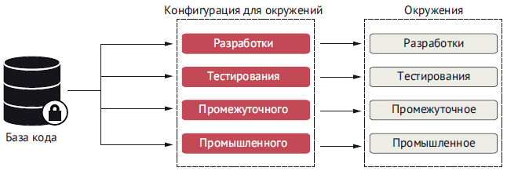
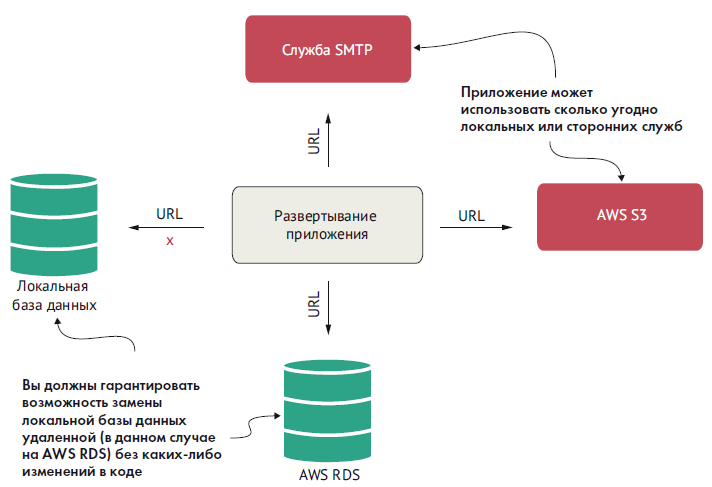
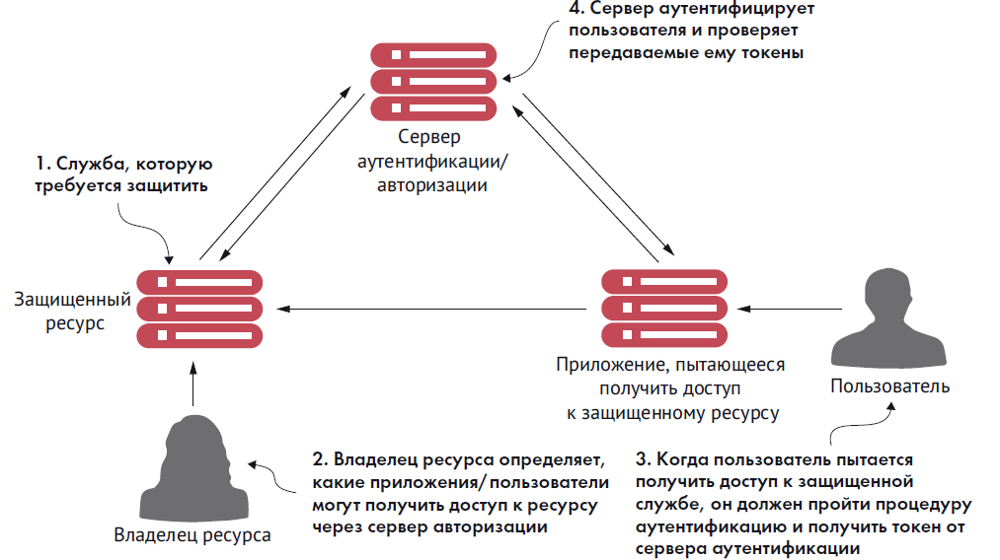

## QA

## Notes

### Основы знаний

###### Характеристики микросервисной архитектуры

- логика приложения разбита на мелкие компоненты с четко определенными согласованными границами ответственности;
- каждый компонент отвечает за узкий круг задач и развертывается независимо от других; один микросервис отвечает за одну часть предметной области;
- для обмена данными между собой микросервисы используют облегченные протоколы, такие как HTTP и JSON (JavaScript Object Notation – форма записи объектов JavaScript);
- приложения на основе микросервисов всегда обмениваются данными с использованием технологически нейтрального формата (чаще всего используется JSON), поэтому техническая реализация службы не имеет значения; это означает, что приложение, состоящее из микросервисов, может быть написано на нескольких языках и с использованием нескольких технологий;
- микросервисы – благодаря небольшому размеру, независимому и распределенному характеру – позволяют организациям иметь небольшие группы разработчиков с четко определенными сферами ответственности. Эти группы могут работать над достижения единой цели, например над созданием приложения, но каждая несет ответственность только за те службы, над которыми они работают.

> небольшие, простые и разделенные службы = масштабируемые, устойчивые и гибкие приложения
### Приложение 12 факторов


##### Кодовая база

В соответствии с этой практикой каждый микросервис должен
иметь свою отдельную базу исходного кода. Кроме того, важно
подчеркнуть, что информация о конфигурации сервера также
должна находиться в системе управления версиями. Помните,
что управление версиями – это управление изменениями в файлах
или в наборе файлов.

База кода может включать несколько экземпляров окружений
развертывания (таких как окружение разработки, окружение те-
стирования, промышленное окружение и т. д.), но не имеет об-
щих компонентов с другими микросервисами. Это важный ориен-
тир, потому что если мы будем использовать общую базу кода для
всех микросервисов, то в конечном итоге создадим множество
неизменяемых выпусков, принадлежащих разным окружениям.

##### Зависимости

Эта практика требует явно объявлять и изолировать зависимости вашего приложения, используя инструменты сборки, такие как Maven или Gradle (Java). Зависимости от сторонних JAR должны объявляться с указанием конкретных номеров версий этих арте-
фактов. Это позволит создавать микросервисы всегда с одной и той же версией библиотеки.


##### Конфигурация

Эта практика относится к хранению конфигураций приложения (особенно конфигураций, зависящих от окружения). Никогда не добавляйте конфигурации в исходный код! Полностью отделяйте конфигурацию от развертываемого микросервиса.

Представьте такой сценарий: вы хотите обновить конфигурацию для микросервиса, 100 экземпляров которого было запущено на сервере. Если конфигурация будет храниться в исходном коде микросервиса, то после внесения изменений в конфигурацию вам придется повторно развернуть все 100 экземпляров. Однако в микросервисе можно реализовать загрузку внешней конфигурации и использовать возможности облака для повторной загрузки конфигурации во время выполнения без перезапуска микросервиса.



##### Вспомогательные службы

Микросервисы часто обмениваются данными по сети с базами
данных, службами RESTful, другими серверами или системами
обмена сообщениями. В таких случаях вы должны гарантировать
возможность замены локальных служб сторонними без каких-либо
изменений в коде приложения.

> Вспомогательная служба – это любая служба, к которой приложение обращается по сети. При развертывании приложения вы должны гарантировать возможность замены локальных служб сторонними без каких либо изменений в коде



##### Сборка, выпуск, выполнение

Эта практика напоминает о необходимости четкого разделения этапов сборки, выпуска и выполнения приложения. Микросервисы не должны зависеть от окружения, в котором они выполняются. Любые изменения в окружении, произведенные после сборки кода, должны приводить к повторению процессов сборки и развертывания. Скомпилированная служба считается зафиксированной и не может быть изменена.

Этап выпуска отвечает за объединение скомпилированной службы с определенной конфигурацией для каждого целевого окружения. Если не разделить разные этапы, то это может привести к проблемам и расхождениям в коде, которые невозможно или – в лучшем случае – трудно отследить. Например, если изменить службу, уже развернутую в промышленном окружении, то изменения не будут зафиксированы в репозитории, и могут возникнуть две ситуации: изменения потеряются в следующих версиях службы или вам
придется копировать изменения в новую версию.

##### Процессы

Микросервисы не должны иметь состояния и хранить только информацию, необходимую для выполнения запрошенной транзакции. Микросервисы могут быть остановлены в любой момент, и потеря экземпляра службы не должна приводить к потере данных. Если состояние все же необходимо, то оно должно храниться в кеше, таком как Redis, или во внутренней базе данных.

##### Привязка портов

Под привязкой портов подразумевается экспортирование служб через определенные порты. В микросервисной архитектуре микросервисы полностью автономны, и каждый имеет свой механизм времени выполнения, упакованный в выполняемый файл вместе с кодом службы. Служба не должна нуждаться в отдельном веб-сервере или сервере приложений и должна поддерживать возможность запуска из командной строки и непосредственного подключения к ней через открытый порт HTTP.
##### Масштабируемость

Согласно практике масштабируемости облачные приложения должны масштабироваться по горизонтали с использованием модели процессов. Что это значит? Это значит, что должна иметься возможность вместо одного процесса запустить несколько процессов, чтобы потом распределить нагрузку между ними.

Под вертикальным масштабированием подразумевается увеличение мощности аппаратной инфраструктуры (процессор, объем ОЗУ), а под горизонтальным – запуск дополнительных экземпляров приложения. В ситуациях, когда возникает потребность в масштабировании, запускайте больше экземпляров микросервисов и выполняйте горизонтальное масштабирование, а не вертикальное.


###### Одноразовость

Микросервисы должны быть одноразовыми и запускаться и оста-
навливаться по запросу, чтобы упростить эластичное масштабиро-
вание и быстрое развертывание приложения и изменений в кон-
фигурации. В идеале запуск должен длиться не дольше пары секунд
с момента команды запуска до момента, когда процесс будет готов
принимать запросы.
Под одноразовостью мы подразумеваем возможность удаления
отказавших экземпляров и запуск новых без влияния на другие
службы. Например, если один из экземпляров микросервиса вый-
дет из строя из-за сбоя в оборудовании, мы можем остановить этот
экземпляр, не затрагивая другие микросервисы, и при необходи-
мости запустить другой экземпляр в другом месте.

##### Сходство окружений разработки/эксплуатации

Эта практика требует обеспечить максимальное сходство разных
окружений (например, разработки, тестирования, промышлен-
ной эксплуатации). Окружения всегда должны содержать похо-
жие версии развернутого кода, инфраструктуры и служб. Этого
можно добиться с помощью непрерывного развертывания, ко-
торое максимально автоматизирует процесс развертывания, по-
зволяя развертывать микросервисы в нескольких окружениях за
короткое время.

После отправки в репозиторий код следует протестировать,
а затем как можно быстрее передать из окружения разработки
в промышленное окружение. Это особенно важно для тех, кто
стремится избежать ошибок развертывания. Сходство окружений
разработки и промышленной эксплуатации позволяет контроли-
ровать все возможные сценарии, которые могут возникнуть при
развертывании и выполнении приложения.

##### Журналирование

Журналы – это поток событий. Журналы должны управляться такими инструментами, как Logstash (https://www.elastic.co/logstash) или Fluentd (https://www.fluentd.org/), которые собирают и хранят журналы в централизованном хранилище. Микросервис никогда не должен заботиться о том, как это происходит. От него требуется только выводить журналируемую информацию в стандартный вывод (stdout).

##### Задачи администрирования

Разработчикам часто приходится выполнять задачи администрирования своих служб (например, переносить или преобразовывать данные). Такие задачи не должны быть уникальными и всегда выполняться только с помощью сценариев, которые хранятся и обслуживаются через репозиторий исходного кода. Сценарии должны быть повторяемыми и неизменяемыми (т. е. код сценария не должен изменяться) в каждом окружении. Важно определить типы задач, которые должны выполняться при запуске микросервиса, чтобы при наличии нескольких микросервисов с такими сценариями мы могли выполнять все задачи администрирования без любых манипуляций вручную

### Безопасность микросервисов


В спецификации OAuth2
предусмотрено четыре типа разрешений:
„ пароль;
„ учетные данные клиента;
„ код авторизации;
„ неявный.

OpenID Connect (OIDC) – это слой поверх инфраструктуры
OAuth2, который обеспечивает аутентификацию и передачу иден-
тификационной информации (удостоверения) о вошедшем в при-
ложение. Серверы авторизации, поддерживающие OIDC, иногда
называют поставщиками удостоверений (identity provider).

##### Кеycloak

Основная цель Keycloak – упростить защиту служб и приложений.
Вот некоторые характеристики Keycloak:
„ централизует аутентификацию и обеспечивает поддержку од-
нократного входа (Single Sign-On, SSO);
„ позволяет разработчикам сосредоточиться на прикладной
логике и не отвлекаться на такие аспекты безопасности, как
авторизация и аутентификация;
„ поддерживает двухфакторную аутентификацию;
„ совместим с LDAP;
„ предлагает несколько адаптеров для простой защиты прило-
жений и серверов;
„ позволяет настраивать политики паролей.



Рис. Keycloak позволяет аутентифицировать пользователя без постоянной
передачи учетных данных

Keycloak выделяет четыре основных компонента: защищенный
ресурс, владельца ресурса, приложение и сервер аутентифика-
ции/авторизации.

- Защищенный ресурс – это ресурс (в нашем случае микросер-
вис), который требуется защитить и который должен быть
доступен только аутентифицированным пользователям, име-
ющим надлежащие разрешения.
- Владелец ресурса – лицо, определяющее, каким приложениям
и пользователям разрешено вызывать службу и какие разре-
шения имеют разные пользователи. Каждому приложению,
зарегистрированному владельцем ресурса, дается идентифи-
кационное имя приложения, а также секретный ключ. Ком-
бинация имени приложения и секретного ключа является
частью учетных данных, которые передаются с токеном до-
ступа для проверки.
- Приложение – это приложение, которое будет вызывать служ-
бу от имени пользователя. В конце концов, пользователи ред-
ко вызывают службы напрямую, вместо этого они полагаются
на приложения, которые выполняют рутинную работу.
- Сервер аутентификации/авторизации – это сервер-посредник
между приложением и службами. Сервер аутентификации по-
зволяет пользователям аутентифицировать себя без передачи
своих учетных данных всем службам, которые приложение бу-
дет вызывать от их имени.

Как упоминалось выше, компоненты безопасности Keycloak
взаимодействуют друг с другом, обеспечивая аутентификацию
пользователей служб. Пользователи проходят аутентификацию
на сервере Keycloak, передавая свои учетные данные и информа-
цию о приложении/устройстве, которое используется для доступа
к защищенному ресурсу (микросервису). Если учетные данные дей-
ствительны, сервер Keycloak возвращает токен аутентификации,
который можно передавать от службы к службе каждый раз, когда
они используются пользователем.
Получив такой токен, защищенный ресурс может связаться
с сервером Keycloak, чтобы проверить действительность токена
и получить список ролей, присвоенных пользователю. Роли ис-
пользуются для группировки пользователей с одинаковыми разре-
шениями и определения ресурсов, к которым они могут обращать-
ся. В этой главе мы используем роли Keycloak для определения
HTTP-команд, которые пользователь может применять для вызова
конечных точек службы.

OAuth2 – это фреймворк безопасности на основе токенов, ко-
торый предоставляет различные механизмы для защиты веб-
служб. Эти механизмы называются грантами, или разрешения-
ми на авторизацию.
-  OpenID Connect (OIDC) – это слой поверх инфраструктуры OAuth2, который обеспечивает аутентификацию и передачу идентификационной информации (удостоверения) о вошедшем в приложение.
-  Keycloak – решение с открытым исходным кодом для управ-
ления идентификацией и доступом для микросервисов и при-
ложений. Основная цель Keycloak – упростить защиту служб
и приложений.
„ Каждое приложение может иметь свое имя в Keycloak и се-
кретный ключ.
„ Каждая служба должна определять, какие действия может вы-
полнять та или иная роль.
„ Spring Cloud Security поддерживает спецификацию JSON Web
Token (JWT). JWT позволяет добавлять свои нестандартные
поля в спецификацию.
„ Защита микросервисов – это больше чем просто аутентифика-
ция и авторизация.
„ В промышленном окружении следует использовать HTTPS
для шифрования всех вызовов между службами.
„ Используйте сервисный шлюз, чтобы сократить количество
точек доступа, через которые можно добраться до службы.
„ Ограничьте поверхность атаки на микросервисы, заблокировав
входящие и исходящие порты в системе, где работает служба.


Рис. Безопасность микросервисной архитектуры – это больше, чем
просто аутентификация и авторизация

###### Декомпозиция бизнес-задачи

Большинство людей, столкнувшись со сложностями, пытаются
разбить задачу, над которой они работают, на более простые подза-
дачи, чтобы не забивать голову множеством мелких деталей. Они
разбивают задачу на несколько основных частей, а затем определя-
ют отношения, существующие между этими частями.
Процесс создания архитектуры микросервисов протекает поч-
ти так же. Архитектор разбивает бизнес-задачу на части, представ-
ляющие отдельные виды деятельности. Эти части инкапсулируют бизнес-правила и логику данных, связанную с определенной ча-
стью предметной области. Например, архитектор может взглянуть
на бизнес-поток, который необходимо реализовать, и понять, что
ему нужна информация как о покупателе, так и о продукте.

> СОВЕТ. Наличие двух отдельных видов данных является хоро-
шим признаком того, что в игре может участвовать несколько
микросервисов. Правила взаимодействий двух разных частей
бизнес-транзакции обычно становятся служебным интерфей-
сом микросервиса.


Разбиение предметной области – это больше искусство, чем точ-
ная наука. Для выявления и выделения кандидатов на создание ми-
кросервисов можно использовать следующие рекомендации.
„ Опишите бизнес-задачу и обратите внимание на существительные,
которые вы используете. Многократное использование одних
и тех же существительных при описании задачи обычно яв-
ляется хорошим признаком некоторой подзадачи, которую
можно организовать в виде отдельного микросервиса. Приме-
рами таких существительных для приложения O-stock могут
быть контракт, лицензии и активы.
„ Обратите внимание на глаголы. Глаголы выделяют действия
и часто отмечают естественные контуры предметной области.
Если вы обнаружите, что говорите: «Транзакция X должна по-
лучить данные от объектов A и B», – то это обычно указывает
на присутствие в игре нескольких служб.
Применив этот подход к приложению O-stock, можно заме-
тить такие утверждения, как: «Когда Майк настраивает новый
компьютер, он выясняет количество лицензий, доступных для
программного обеспечения X, и, если лицензии доступны,
устанавливает программное обеспечение. Затем он обновляет
количество используемых лицензий в своей электронной та-
блице отслеживания». Ключевые глаголы здесь – это выясняет
и обновляет.
- Ищите тесно связанные данные. Разбивая бизнес-задачу на отельные части, ищите фрагменты данных, тесно связанные друг с другом. Если вдруг в процессе обсуждения обнаруживается необходимость чтения или обновления данных, которые радикально отличаются от того, что вы обсуждали, то это может указывать на еще одного кандидата в микросервисы. Микросервисы должны владеть только своими данными.

Вопрос детализации очень важен при создании микросервисной
архитектуры. Вот почему мы хотим объяснить следующие концеп-
ции, которые помогут подобрать правильную степень детализации.

- Лучше сначала создать микросервис с широкой областью охвата, а затем
выполнить рефакторинг и разбить его на более мелкие службы. Вступая
на путь создания микросервисов, легко переборщить и превра-
тить в микросервисы все и вся. Однако разделение предметной
области на большое количество мелких служб часто приводит
к избыточной сложности, потому что микросервисы превраща-
ются в службы, управляющие мелкими фрагментами данных.

- В первую очередь сосредоточьтесь на взаимодействиях служб. Это
поможет определить общие интерфейсы в предметной обла-
сти. Слишком широкие службы проще реорганизовать, чем
слишком мелкие.
- Круг обязанностей служб меняется с развитием нашего понимания пред-
метной области. Часто с появлением необходимости внедрения
новых возможностей в приложение круг обязанностей микро-
сервиса расширяется. То, что сначала было небольшим микро-
сервисом, может разделиться на несколько служб, при этом ис-
ходный микросервис превращается в уровень оркестровки но-
вых служб и инкапсулирует их функциональные возможности.

###### Какие черты позволяют отличить плохой микросервис? Как узнать, правильный ли размер имеет микросервис? 

Если микросервис получился слишком большой, то мы увидим:

-  службу со слишком широким кругом обязанностей. Общий поток бизнес-логики в службе выглядит сложным и требует применения чрезмерно разнообразного набора правил;
-  службу, которая управляет данными в большом количестве таблиц. Микросервис – это представление данных, которыми он управляет. Если вы обнаружите, что микросервис манипулирует данными в нескольких таблицах, или обращаетесь к таблицам за пределами своей базы данных, то это явный признак того, что служба слишком велика. Мы в своей практике пользуемся простым правилом: микросервис должен управлять не более чем тремя-пятью таблицами. Если таблиц больше, то, скорее всего, служба имеет слишком широкий круг обязанностей;
- службу со слишком большим количеством тестов. Службы имеют свойство разрастаться со временем. Если первоначально для вашей службы имелось небольшое количество модульных и интеграционных тестов, которое постепенно достигло нескольких сотен, то вам может потребоваться выполнить рефакторинг. 

А что можно сказать о слишком мелких микросервисах?

- Микросервисы, принадлежащие одной части предметной области, размножились как кролики. При дроблении предметной области на слишком мелкие микросервисы становится очень сложно организовать бизнес-логику. Это связано со стремительным ростом количества служб, необходимых для выполнения работы. Типичный признак – наличие в приложении десятков микросервисов, каждый из которых взаимодействует только с одной таблицей в базе данных.
- Микросервисы сильно зависят друг от друга. Микросервисы в одной части предметной области часто обращаться друг к другу, чтобы обработать один пользовательский запрос.
- Микросервисы становятся набором простых служб CRUD (Create, Replace, Update, Delete – создание, замена, обновление, удаление). Микросервисы – это выражение бизнес-логики, а не слой абстракции над вашими источниками данных. Если микросервисы не выполняют ничего, кроме логики, связанной с CRUD, то они, вероятно, слишком мелкие.

> Архитектура микросервисов должна развиваться эволюционно, и важно понимать, что получить правильную архитектуру с первого раза не получится. Именно поэтому лучше начинать с создания более широких служб.

###### Определение интерфейсов служб

Последняя задача архитектора – определение правил взаимодей-
ствий микросервисов друг с другом. Интерфейсы служб должны
быть простыми и очевидными, а разработчики должны представ-
лять общую картину работы всех служб в приложении и полно-
стью понимать работу одной или двух служб. Вот несколько общих
рекомендаций по определению интерфейсов служб.

- Возьмите на вооружение философию REST. Это одна из лучших
практик, наряду с моделью зрелости Ричардсона. Для взаимодействий между службами философия REST предлагает использовать протокол HTTP с его стандартными глаголами (GET,
PUT, POST и DELETE). Моделируйте базовое поведение своих служб, опираясь на эти HTTP-глаголы.
- Используйте URI для обозначения намерений. URI, выступающие
в роли конечных точек службы, должны описывать различ-
ные ресурсы в вашей предметной области и служить механиз-
мом отношений между этими ресурсами.
- Используйте JSON для оформления запросов и ответов. JSON – это
чрезвычайно легковесный протокол сериализации данных,
и он гораздо проще в использовании, чем XML.
Используйте коды состояния HTTP для передачи результатов. Про-
токол HTTP имеет обширный набор стандартных кодов со-
стояния, указывающих на успех или ошибку. Изучите эти коды
и, что особенно важно, используйте их единообразно во всех
своих службах.
Все эти базовые рекомендации сходятся к одному: сделайте ин-
терфейсы служб простыми для понимания и использования. Ин-
терфейсы должны быть определены так, чтобы разработчик сел,
посмотрел на них и тут же начал их использовать. Если интерфейс
микросервиса сложен в использовании, то разработчики прило-
жат все силы, чтобы обойти его и разрушить замысел архитектуры.

###### Когда не следует использовать микросервисы

Выше в этой главе мы уже говорили, почему микросервисы явля-
ются мощным архитектурным шаблоном. Но мы ничего не сказали
о том, когда не следует использовать микросервисы для создания
приложений. Давайте рассмотрим основные препятствия:
„ сложность распределенных систем;
„ беспорядочный рост виртуальных серверов или контейнеров;
„ тип приложения;
„ транзакции и согласованность данных.


###### Сложность распределенных систем
Микросервисы по своей природе являются небольшими и рас-
пределенными службами, поэтому они влекут за собой дополни-
тельные сложности, отсутствующие в монолитных приложениях.
Микросервисные архитектуры требуют высокой степени техниче-
ской зрелости. Не следует рассматривать возможность использова-
ния микросервисов, если ваша организация не желает вкладывать
средства в автоматизацию эксплуатации и сопровождения (мони-
торинг, масштабирование и т. д.), необходимую для надежной ра-
боты распределенного приложения.
###### Беспорядочный рост виртуальных серверов или контейнеров
Одна из наиболее распространенных моделей развертывания ми-
кросервисов – один экземпляр микросервиса в одном контейнере.
Большое приложение на основе микросервисов может оказаться
развернутым на большом количестве (от 50 до 100) серверов или
контейнеров (обычно виртуальных), которые необходимо созда-
вать и поддерживать. Даже при невысокой стоимости запуска этих
служб в облаке сложность управления и мониторинга всего ком-
плекса микросервисов может быть колоссальной.

> Учитывайте не только гибкость микросервисов,
но также стоимость эксплуатации всех этих серверов. Часто
у вас могут быть на выбор разные альтернативы, такие как раз-
работка лямбда-функций или запуск нескольких экземпляров
микросервисов на одном сервере.

###### Тип приложения
Микросервисы ориентированы на многократное использование
и чрезвычайно полезны для создания больших приложений, ко-
торые должны быть очень устойчивыми и масштабируемыми. Это
одна из причин высокой популярности микросервисов. Если вы соз-
даете небольшие приложения для отдельных подразделений своей
организации или с небольшой базой пользователей, то сложность,
сопутствующая построению распределенной модели на основе ми-
кросервисов, может привести к неоправданному увеличению затрат.
###### Транзакции и согласованность данных
Начиная рассматривать возможность внедрения микросервисов,
обязательно исследуйте шаблоны использования данных вашими
службами и пользователями. Микросервис обертывает небольшое
количество таблиц и хорошо работает как механизм выполнения
простых задач, таких как создание и добавление данных и выпол-
нение несложных запросов к хранилищу данных.
Если приложение должно выполнять сложные преобразования
или агрегировать данные из нескольких источников, то распреде-
ленная природа микросервисов затруднит эту работу. Ваши микро-
сервисы неизбежно будут брать на себя слишком много ответствен-
ности и могут стать уязвимыми для проблем с производительностью.

###### Команды Docker

FROM Определяет базовый образ, с которого начинается процесс сборки. Проще
говоря, команда FROM определяет образ Docker, который будет использо-
ваться во время выполнения
LABEL Добавляет метаданные в образ. Это пара ключ/значение
ARG Определяет переменные для передачи построителю, который вызывается
командой docker build
COPY Копирует новые файлы, каталоги или данные из удаленных URL и добавляет их
в файловую систему создаваемого образа, например COPY ${JAR_FILE} app.jar)
VOLUME Создает точку монтирования в контейнере. Когда создается новый контей-
нер с использованием того же образа, вместе с ним будет создан новый
том файловой системы, изолированный от томов других контейнеров
RUN Выполняет указанную команду с указанными аргументами при запуске
контейнера из образа. Часто используется для установки дополнительного
программного обеспечения
CMD Перечисляет аргументы для ENTRYPOINT. Эта команда напоминает docker
run, но выполняется после установки контейнера
ADD Копирует дополнительные файлы в контейнер
ENTRYPOINT Определяет команду, которая будет выполняться после установки контейнера
ENV Определяет переменные окружения

###### Команды Docker Compose
docker-compose up -d Создает образы для приложения и запускает определенные
вами службы. Эта команда загружает все необходимые обра-
зы, затем развертывает их и запускает контейнер. Параметр
-d требует запустить Docker в фоновом режиме
docker-compose logs Позволяет просмотреть всю информацию о последнем раз-
вертывании
docker-compose logs <service_id> Позволяет просмотреть журналы для конкретной службы.
Например, просмотреть историю развертывания службы
лицензий можно с помощью команды docker-compose logs
licenseService
docker-compose ps Выведет список всех контейнеров, которые вы развернули
в своей системе
docker-compose stop Останавливает запущенные вами службы. Также останавли-
вает контейнеры
docker-compose down Останавливает все службы и удаляет все контейнеры

### Хранение конфигурации

##### Варианты реализации

| Решение                                 | Описание                                                                                                                                                                                                                                                                                                                                                                                                                                                                       | Характеристики                                                                                                                                                                                                                                                                  |
| --------------------------------------- | ------------------------------------------------------------------------------------------------------------------------------------------------------------------------------------------------------------------------------------------------------------------------------------------------------------------------------------------------------------------------------------------------------------------------------------------------------------------------------ | ------------------------------------------------------------------------------------------------------------------------------------------------------------------------------------------------------------------------------------------------------------------------------- |
| etcd                                    | Реализовано на Go. Используется для обнаружения служб и в качестве хранилища пар ключ/значение. Использует протокол<br>raft (https://raft.github.io/) для своей модели распределенных вычислений                                                                                                                                                                                                                                                                               | Высокая скорость<br>Масштабируемость<br>Управление из командной строки<br>Простота в использовании и настройке                                                                                                                                                                  |
| Eureka                                  | Написано в компании Netflix.<br>Чрезвычайно надежное. Используется для обнаружения служб и в качестве хранилища пар ключ/значение. Прим.  Каждый сервис при регистрации в Eureka может передать произвольный набор пар ключ-значение (строка-строка). Теоретически, можно злоупотребить этим механизмом и запихнуть туда какую-то простую конфигурацию. В настройках сервиса (например, в application.yml) указываются метаданные (metadataMap), которые он хочет опубликовать | Распределенное хранилище пар ключ/значение<br>Высокая гибкость, но требует некоторых усилий<br>для настройки<br>Поддерживает динамическое обновление клиентов из коробки                                                                                                        |
| Consul                                  | Написано в компании HashiCorp.<br>Похоже на etcd и Eureka, но использует иной алгоритм в модели распределенных вычислений                                                                                                                                                                                                                                                                                                                                                      | Высокая скорость<br>Предлагает свою поддержку обнаружения<br>служб с возможностью интеграции с DNS<br>Не поддерживает динамическое обновление<br>клиентов из коробки                                                                                                            |
| Zookeeper                               | Проект Apache. Поддерживает распределенные блокировки. Часто используется в качестве<br>решения для управления конфигурацией и в качестве хранилища пар ключ/значение. `spring-cloud-starter-zookeeper-config`, `spring-cloud-starter-zookeeper-discovery` [Spring Cloud Zookeeper](https://docs.spring.io/spring-cloud-zookeeper/docs/current/reference/html/)                                                                                                                | Давнее и хорошо проверенное решение<br>Высокая сложность использования<br>Может применяться для управления конфигу-<br>рациями, но только если вы уже используете<br>Zookeeper в своей архитектуре                                                                              |
| Spring Cloud<br>Configuration<br>Server | Решение с открытым исходным кодом. Универсальное решение для управления конфигурациями с несколькими базовыми механизмами хранения                                                                                                                                                                                                                                                                                                                                             | Нераспределенное хранилище пар ключ/значение<br>Предлагает тесную интеграцию со службами,<br>использующими и не использующими Spring<br>Позволяет задействовать несколько базовых механизмов для хранения конфигураций, включая<br>общие файловые системы, Eureka, Consul и Git |
##### Spring Cloud Configuration

###### Обновление настроек с использованием Spring Cloud Config Server

Однако приложения Spring Boot читают конфигурацию только в момент запуска, поэтому изменения, выполненные в Config Server, не попадут в приложения автоматически. Для решения этой проблемы Spring Boot Actuator предлагает аннотацию @RefreshScope, которая позволяет получить доступ к конечной точке /refresh и заставить приложение Spring Boot повторно прочитать свою конфигурацию.

```java
@SpringBootApplication
@RefreshScope
public class LicenseServiceApplication {
	public static void main(String[] args) {
		SpringApplication.run(LicenseServiceApplication.class, args);
	}
}
```

###### Использование Spring Cloud Configuration Server на основе файловой
системы в bootstrap.yml

```yaml
spring:
	application:
		name: config-server
	profiles:
		active: native
	cloud:
		config:
			server:
			# Локальная конфигурация: это может быть
			# classpath или конкретный каталог в файловой системе.
				native:
				# Определение конкретной папки в файловой системе
					search-locations: classpath:/config
```

###### Использование Spring Cloud Configuration Server с Git

```yaml
spring:
	application:
		name: config-server
	profiles:
		active:
			- native, git
	cloud:
		config:
			server:
			native:
				search-locations: classpath:/config
			git:
				uri: https://github.com/ihuaylupo/config.git
			searchPaths: licensingservice
server:
	port: 8071
```

###### Пример выдачи конфигурации по EP config server


Рис. Конечные точки Spring Cloud Config возвращают настройки для
заданного окружения

> @RefreshScope добавляет эндпоинт refresh на сервисе, заставляя его снова сходить на конфиг сервер за обновленной кофигурацией. Все потому что сервисы при поднятиее запоминают конфигурацию и не знают об происходящих изменениях. Еще один вариант решения Cloud Bus, событийно ориентированный

### Обнаружение служб


Традиционная модель определения местоположения службы
с использованием DNS и балансировщика нагрузки

Модель этого типа хорошо подходит для приложений, которые
действуют внутри четырех стен корпоративного центра обработ-
ки данных и имеют относительно небольшое количество служб,
развернутых на нескольких статических серверах, но она непри-
годна для облачных приложений на основе микросервисов по сле-
дующим причинам:

- даже притом что балансировщик нагрузки можно сделать высокодо-
ступным, он образует единственную точку отказа для всей инфра-
структуры. Если балансировщик нагрузки отключится, то вме-
сте с ним отключатся все приложения, находящиеся за ним.
Балансировщик нагрузки можно сделать высокодоступным,
но обычно балансировщики нагрузки образуют централизо-
ванные узкие места в инфраструктуре приложений;
- объединение служб в единый кластер с балансировщиками нагрузки
ограничивает возможность горизонтального масштабирования на
нескольких серверах. Многие коммерческие балансировщики на-
грузки накладывают два ограничения: модель избыточности
и стоимость лицензирования.

- большинство традиционных балансировщиков нагрузки управляет-
ся статически. Они не предназначены для быстрой регистра-
ции и дерегистрации служб. Традиционные балансировщики нагрузки используют централизованную базу данных для хра-
нения маршрутов и правил, и часто единственный способ до-
бавить новые маршруты – использовать проприетарный API
производителя;
- балансировщик нагрузки действует подобно прокси-серверу для служб,
поэтому запросы клиентов должны отображаться в физические
службы. Этот дополнительный уровень трансляции увеличи-
вает общую сложность инфраструктуры служб, потому что
правила трансляции должны определяться и развертываться
вручную. Кроме того, традиционный сценарий балансировки
нагрузки не предусматривает регистрацию новых экземпля-
ров службы при их запуске.


## Examples

##### Keycloak docker-compose.yml

```java
	keycloak:
	image: jboss/keycloak
	restart: always
	environment:
	    KEYCLOAK_USER: admin
	    KEYCLOAK_PASSWORD: admin
	ports:
	    - "8180:8080"
	networks:
	    backend:
	        aliases:
	           - "keycloak"
```

`docker-compose -f docker/docker-compose.yml up`
## Connections

## Best Practices

## Warnings

## Practical Tasks

## Project Ideas

## Diagrams


Рис. Общая структура сервисов и технологий, которые используются в книге
## Resources

- [Проект из книги](https://github.com/ihuaylupo/manning-smia/tree/master)
- [Spring Cloud Zookeeper](https://docs.spring.io/spring-cloud-zookeeper/docs/current/reference/html/#_spring_cloud_zookeeper)
- [Spring Cloud Config](https://docs.spring.io/spring-cloud-config/docs/current/reference/html/)
- 