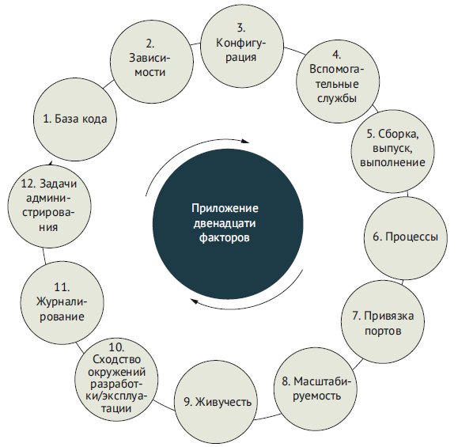
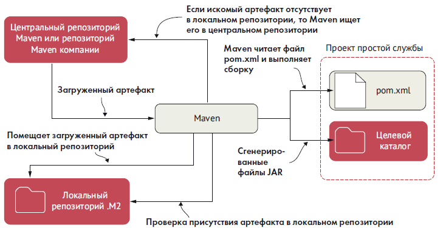
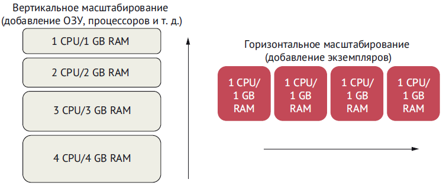
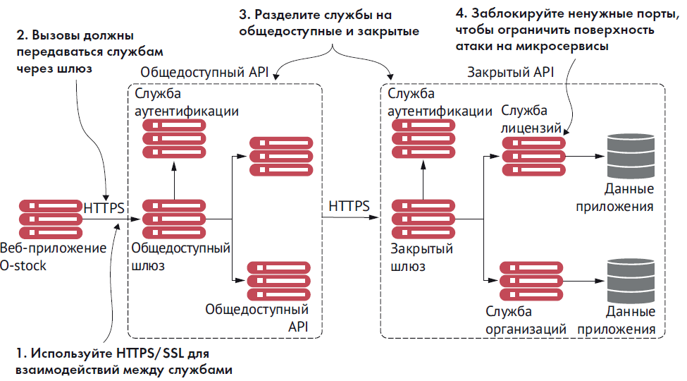
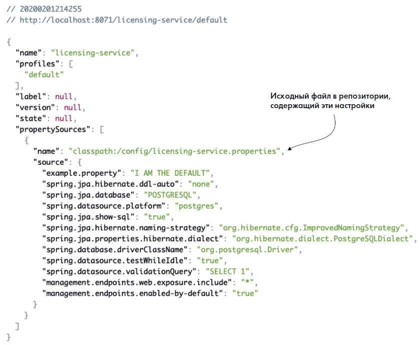
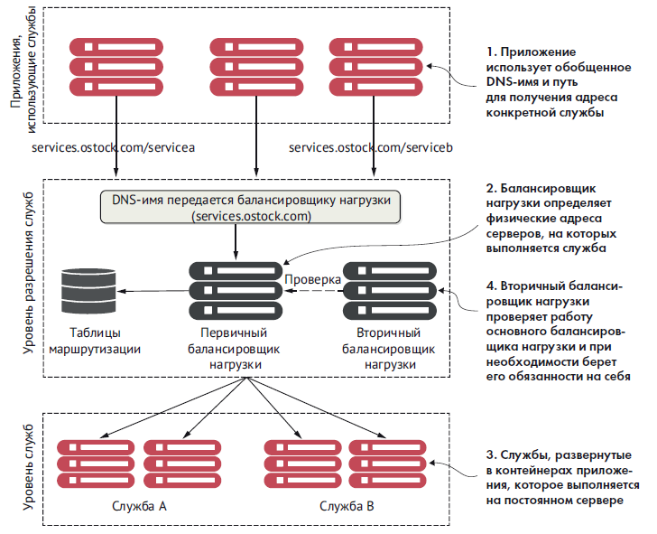
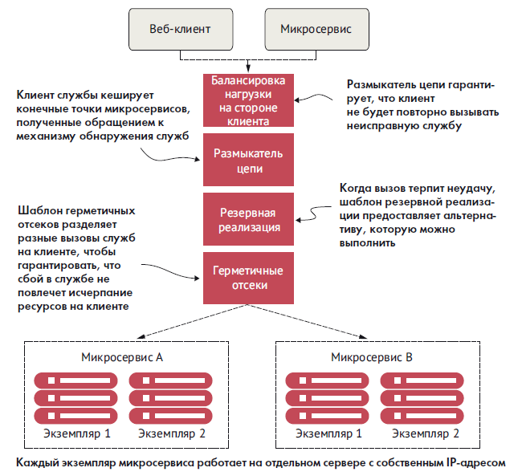
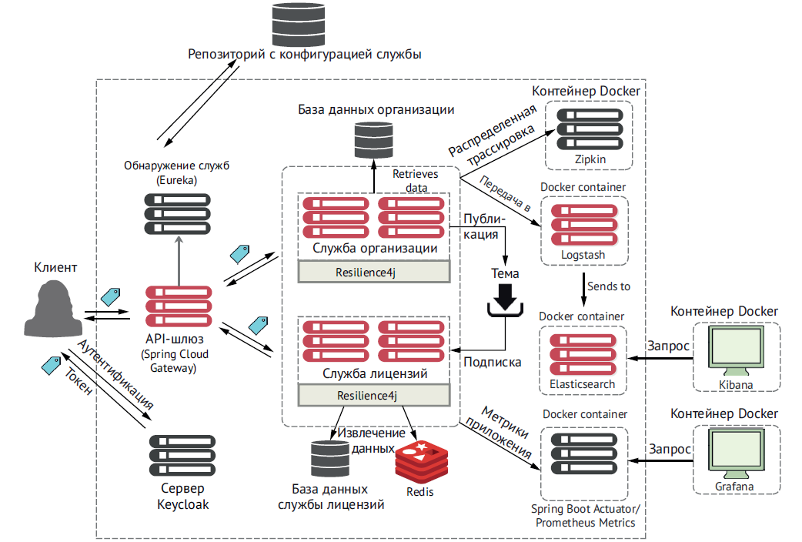

## QA

## Notes

### Основы знаний

###### Характеристики микросервисной архитектуры

- логика приложения разбита на мелкие компоненты с четко определенными согласованными границами ответственности;
- каждый компонент отвечает за узкий круг задач и развертывается независимо от других; один микросервис отвечает за одну часть предметной области;
- для обмена данными между собой микросервисы используют облегченные протоколы, такие как HTTP и JSON (JavaScript Object Notation – форма записи объектов JavaScript);
- приложения на основе микросервисов всегда обмениваются данными с использованием технологически нейтрального формата (чаще всего используется JSON), поэтому техническая реализация службы не имеет значения; это означает, что приложение, состоящее из микросервисов, может быть написано на нескольких языках и с использованием нескольких технологий;
- микросервисы – благодаря небольшому размеру, независимому и распределенному характеру – позволяют организациям иметь небольшие группы разработчиков с четко определенными сферами ответственности. Эти группы могут работать над достижения единой цели, например над созданием приложения, но каждая несет ответственность только за те службы, над которыми они работают.

> небольшие, простые и разделенные службы = масштабируемые, устойчивые и гибкие приложения
### Приложение 12 факторов



##### Кодовая база

В соответствии с этой практикой каждый микросервис должен
иметь свою отдельную базу исходного кода. Кроме того, важно
подчеркнуть, что информация о конфигурации сервера также
должна находиться в системе управления версиями. Помните,
что управление версиями – это управление изменениями в файлах
или в наборе файлов.

База кода может включать несколько экземпляров окружений
развертывания (таких как окружение разработки, окружение те-
стирования, промышленное окружение и т. д.), но не имеет об-
щих компонентов с другими микросервисами. Это важный ориен-
тир, потому что если мы будем использовать общую базу кода для
всех микросервисов, то в конечном итоге создадим множество
неизменяемых выпусков, принадлежащих разным окружениям.

##### Зависимости

Эта практика требует явно объявлять и изолировать зависимости вашего приложения, используя инструменты сборки, такие как Maven или Gradle (Java). Зависимости от сторонних JAR должны объявляться с указанием конкретных номеров версий этих арте-
фактов. Это позволит создавать микросервисы всегда с одной и той же версией библиотеки.


##### Конфигурация

Эта практика относится к хранению конфигураций приложения (особенно конфигураций, зависящих от окружения). Никогда не добавляйте конфигурации в исходный код! Полностью отделяйте конфигурацию от развертываемого микросервиса.

Представьте такой сценарий: вы хотите обновить конфигурацию для микросервиса, 100 экземпляров которого было запущено на сервере. Если конфигурация будет храниться в исходном коде микросервиса, то после внесения изменений в конфигурацию вам придется повторно развернуть все 100 экземпляров. Однако в микросервисе можно реализовать загрузку внешней конфигурации и использовать возможности облака для повторной загрузки конфигурации во время выполнения без перезапуска микросервиса.


##### Вспомогательные службы

Микросервисы часто обмениваются данными по сети с базами
данных, службами RESTful, другими серверами или системами
обмена сообщениями. В таких случаях вы должны гарантировать
возможность замены локальных служб сторонними без каких-либо
изменений в коде приложения.

> Вспомогательная служба – это любая служба, к которой приложение обращается по сети. При развертывании приложения вы должны гарантировать возможность замены локальных служб сторонними без каких либо изменений в коде


##### Сборка, выпуск, выполнение

Эта практика напоминает о необходимости четкого разделения этапов сборки, выпуска и выполнения приложения. Микросервисы не должны зависеть от окружения, в котором они выполняются. Любые изменения в окружении, произведенные после сборки кода, должны приводить к повторению процессов сборки и развертывания. Скомпилированная служба считается зафиксированной и не может быть изменена.

Этап выпуска отвечает за объединение скомпилированной службы с определенной конфигурацией для каждого целевого окружения. Если не разделить разные этапы, то это может привести к проблемам и расхождениям в коде, которые невозможно или – в лучшем случае – трудно отследить. Например, если изменить службу, уже развернутую в промышленном окружении, то изменения не будут зафиксированы в репозитории, и могут возникнуть две ситуации: изменения потеряются в следующих версиях службы или вам
придется копировать изменения в новую версию.

##### Процессы

Микросервисы не должны иметь состояния и хранить только информацию, необходимую для выполнения запрошенной транзакции. Микросервисы могут быть остановлены в любой момент, и потеря экземпляра службы не должна приводить к потере данных. Если состояние все же необходимо, то оно должно храниться в кеше, таком как Redis, или во внутренней базе данных.

##### Привязка портов

Под привязкой портов подразумевается экспортирование служб через определенные порты. В микросервисной архитектуре микросервисы полностью автономны, и каждый имеет свой механизм времени выполнения, упакованный в выполняемый файл вместе с кодом службы. Служба не должна нуждаться в отдельном веб-сервере или сервере приложений и должна поддерживать возможность запуска из командной строки и непосредственного подключения к ней через открытый порт HTTP.
##### Масштабируемость

Согласно практике масштабируемости облачные приложения должны масштабироваться по горизонтали с использованием модели процессов. Что это значит? Это значит, что должна иметься возможность вместо одного процесса запустить несколько процессов, чтобы потом распределить нагрузку между ними.

Под вертикальным масштабированием подразумевается увеличение мощности аппаратной инфраструктуры (процессор, объем ОЗУ), а под горизонтальным – запуск дополнительных экземпляров приложения. В ситуациях, когда возникает потребность в масштабировании, запускайте больше экземпляров микросервисов и выполняйте горизонтальное масштабирование, а не вертикальное.



###### Одноразовость

Микросервисы должны быть одноразовыми и запускаться и оста-
навливаться по запросу, чтобы упростить эластичное масштабиро-
вание и быстрое развертывание приложения и изменений в кон-
фигурации. В идеале запуск должен длиться не дольше пары секунд
с момента команды запуска до момента, когда процесс будет готов
принимать запросы.
Под одноразовостью мы подразумеваем возможность удаления
отказавших экземпляров и запуск новых без влияния на другие
службы. Например, если один из экземпляров микросервиса вый-
дет из строя из-за сбоя в оборудовании, мы можем остановить этот
экземпляр, не затрагивая другие микросервисы, и при необходи-
мости запустить другой экземпляр в другом месте.

##### Сходство окружений разработки/эксплуатации

Эта практика требует обеспечить максимальное сходство разных
окружений (например, разработки, тестирования, промышлен-
ной эксплуатации). Окружения всегда должны содержать похо-
жие версии развернутого кода, инфраструктуры и служб. Этого
можно добиться с помощью непрерывного развертывания, ко-
торое максимально автоматизирует процесс развертывания, по-
зволяя развертывать микросервисы в нескольких окружениях за
короткое время.

После отправки в репозиторий код следует протестировать,
а затем как можно быстрее передать из окружения разработки
в промышленное окружение. Это особенно важно для тех, кто
стремится избежать ошибок развертывания. Сходство окружений
разработки и промышленной эксплуатации позволяет контроли-
ровать все возможные сценарии, которые могут возникнуть при
развертывании и выполнении приложения.

##### Журналирование

Журналы – это поток событий. Журналы должны управляться такими инструментами, как Logstash (https://www.elastic.co/logstash) или Fluentd (https://www.fluentd.org/), которые собирают и хранят журналы в централизованном хранилище. Микросервис никогда не должен заботиться о том, как это происходит. От него требуется только выводить журналируемую информацию в стандартный вывод (stdout).

##### Задачи администрирования

Разработчикам часто приходится выполнять задачи администрирования своих служб (например, переносить или преобразовывать данные). Такие задачи не должны быть уникальными и всегда выполняться только с помощью сценариев, которые хранятся и обслуживаются через репозиторий исходного кода. Сценарии должны быть повторяемыми и неизменяемыми (т. е. код сценария не должен изменяться) в каждом окружении. Важно определить типы задач, которые должны выполняться при запуске микросервиса, чтобы при наличии нескольких микросервисов с такими сценариями мы могли выполнять все задачи администрирования без любых манипуляций вручную

### Безопасность микросервисов


В спецификации OAuth2
предусмотрено четыре типа разрешений:
„ пароль;
„ учетные данные клиента;
„ код авторизации;
„ неявный.

OpenID Connect (OIDC) – это слой поверх инфраструктуры
OAuth2, который обеспечивает аутентификацию и передачу иден-
тификационной информации (удостоверения) о вошедшем в при-
ложение. Серверы авторизации, поддерживающие OIDC, иногда
называют поставщиками удостоверений (identity provider).

##### Кеycloak

Основная цель Keycloak – упростить защиту служб и приложений.
Вот некоторые характеристики Keycloak:
„ централизует аутентификацию и обеспечивает поддержку од-
нократного входа (Single Sign-On, SSO);
„ позволяет разработчикам сосредоточиться на прикладной
логике и не отвлекаться на такие аспекты безопасности, как
авторизация и аутентификация;
„ поддерживает двухфакторную аутентификацию;
„ совместим с LDAP;
„ предлагает несколько адаптеров для простой защиты прило-
жений и серверов;
„ позволяет настраивать политики паролей.


Рис. Keycloak позволяет аутентифицировать пользователя без постоянной
передачи учетных данных

Keycloak выделяет четыре основных компонента: защищенный
ресурс, владельца ресурса, приложение и сервер аутентифика-
ции/авторизации.

- Защищенный ресурс – это ресурс (в нашем случае микросер-
вис), который требуется защитить и который должен быть
доступен только аутентифицированным пользователям, име-
ющим надлежащие разрешения.
- Владелец ресурса – лицо, определяющее, каким приложениям
и пользователям разрешено вызывать службу и какие разре-
шения имеют разные пользователи. Каждому приложению,
зарегистрированному владельцем ресурса, дается идентифи-
кационное имя приложения, а также секретный ключ. Ком-
бинация имени приложения и секретного ключа является
частью учетных данных, которые передаются с токеном до-
ступа для проверки.
- Приложение – это приложение, которое будет вызывать служ-
бу от имени пользователя. В конце концов, пользователи ред-
ко вызывают службы напрямую, вместо этого они полагаются
на приложения, которые выполняют рутинную работу.
- Сервер аутентификации/авторизации – это сервер-посредник
между приложением и службами. Сервер аутентификации по-
зволяет пользователям аутентифицировать себя без передачи
своих учетных данных всем службам, которые приложение бу-
дет вызывать от их имени.

Как упоминалось выше, компоненты безопасности Keycloak
взаимодействуют друг с другом, обеспечивая аутентификацию
пользователей служб. Пользователи проходят аутентификацию
на сервере Keycloak, передавая свои учетные данные и информа-
цию о приложении/устройстве, которое используется для доступа
к защищенному ресурсу (микросервису). Если учетные данные дей-
ствительны, сервер Keycloak возвращает токен аутентификации,
который можно передавать от службы к службе каждый раз, когда
они используются пользователем.
Получив такой токен, защищенный ресурс может связаться
с сервером Keycloak, чтобы проверить действительность токена
и получить список ролей, присвоенных пользователю. Роли ис-
пользуются для группировки пользователей с одинаковыми разре-
шениями и определения ресурсов, к которым они могут обращать-
ся. В этой главе мы используем роли Keycloak для определения
HTTP-команд, которые пользователь может применять для вызова
конечных точек службы.

###### Keycloak docker-compose.yml

```java
	keycloak:
	image: jboss/keycloak
	restart: always
	environment:
	    KEYCLOAK_USER: admin
	    KEYCLOAK_PASSWORD: admin
	ports:
	    - "8180:8080"
	networks:
	    backend:
	        aliases:
	           - "keycloak"
```

##### OAuth2

OAuth2 – это фреймворк безопасности на основе токенов, ко-
торый предоставляет различные механизмы для защиты веб-
служб. Эти механизмы называются грантами, или разрешения-
ми на авторизацию.
-  OpenID Connect (OIDC) – это слой поверх инфраструктуры OAuth2, который обеспечивает аутентификацию и передачу идентификационной информации (удостоверения) о вошедшем в приложение.
-  Keycloak – решение с открытым исходным кодом для управ-
ления идентификацией и доступом для микросервисов и при-
ложений. Основная цель Keycloak – упростить защиту служб
и приложений.
„ Каждое приложение может иметь свое имя в Keycloak и се-
кретный ключ.
„ Каждая служба должна определять, какие действия может вы-
полнять та или иная роль.
„ Spring Cloud Security поддерживает спецификацию JSON Web
Token (JWT). JWT позволяет добавлять свои нестандартные
поля в спецификацию.
„ Защита микросервисов – это больше чем просто аутентифика-
ция и авторизация.
„ В промышленном окружении следует использовать HTTPS
для шифрования всех вызовов между службами.
„ Используйте сервисный шлюз, чтобы сократить количество
точек доступа, через которые можно добраться до службы.
„ Ограничьте поверхность атаки на микросервисы, заблокировав
входящие и исходящие порты в системе, где работает служба.



Рис. Безопасность микросервисной архитектуры – это больше, чем
просто аутентификация и авторизация

###### Декомпозиция бизнес-задачи

Большинство людей, столкнувшись со сложностями, пытаются
разбить задачу, над которой они работают, на более простые подза-
дачи, чтобы не забивать голову множеством мелких деталей. Они
разбивают задачу на несколько основных частей, а затем определя-
ют отношения, существующие между этими частями.
Процесс создания архитектуры микросервисов протекает поч-
ти так же. Архитектор разбивает бизнес-задачу на части, представ-
ляющие отдельные виды деятельности. Эти части инкапсулируют бизнес-правила и логику данных, связанную с определенной ча-
стью предметной области. Например, архитектор может взглянуть
на бизнес-поток, который необходимо реализовать, и понять, что
ему нужна информация как о покупателе, так и о продукте.

> СОВЕТ. Наличие двух отдельных видов данных является хоро-
шим признаком того, что в игре может участвовать несколько
микросервисов. Правила взаимодействий двух разных частей
бизнес-транзакции обычно становятся служебным интерфей-
сом микросервиса.


Разбиение предметной области – это больше искусство, чем точ-
ная наука. Для выявления и выделения кандидатов на создание ми-
кросервисов можно использовать следующие рекомендации.
„ Опишите бизнес-задачу и обратите внимание на существительные,
которые вы используете. Многократное использование одних
и тех же существительных при описании задачи обычно яв-
ляется хорошим признаком некоторой подзадачи, которую
можно организовать в виде отдельного микросервиса. Приме-
рами таких существительных для приложения O-stock могут
быть контракт, лицензии и активы.
„ Обратите внимание на глаголы. Глаголы выделяют действия
и часто отмечают естественные контуры предметной области.
Если вы обнаружите, что говорите: «Транзакция X должна по-
лучить данные от объектов A и B», – то это обычно указывает
на присутствие в игре нескольких служб.
Применив этот подход к приложению O-stock, можно заме-
тить такие утверждения, как: «Когда Майк настраивает новый
компьютер, он выясняет количество лицензий, доступных для
программного обеспечения X, и, если лицензии доступны,
устанавливает программное обеспечение. Затем он обновляет
количество используемых лицензий в своей электронной та-
блице отслеживания». Ключевые глаголы здесь – это выясняет
и обновляет.
- Ищите тесно связанные данные. Разбивая бизнес-задачу на отельные части, ищите фрагменты данных, тесно связанные друг с другом. Если вдруг в процессе обсуждения обнаруживается необходимость чтения или обновления данных, которые радикально отличаются от того, что вы обсуждали, то это может указывать на еще одного кандидата в микросервисы. Микросервисы должны владеть только своими данными.

Вопрос детализации очень важен при создании микросервисной
архитектуры. Вот почему мы хотим объяснить следующие концеп-
ции, которые помогут подобрать правильную степень детализации.

- Лучше сначала создать микросервис с широкой областью охвата, а затем
выполнить рефакторинг и разбить его на более мелкие службы. Вступая
на путь создания микросервисов, легко переборщить и превра-
тить в микросервисы все и вся. Однако разделение предметной
области на большое количество мелких служб часто приводит
к избыточной сложности, потому что микросервисы превраща-
ются в службы, управляющие мелкими фрагментами данных.

- В первую очередь сосредоточьтесь на взаимодействиях служб. Это
поможет определить общие интерфейсы в предметной обла-
сти. Слишком широкие службы проще реорганизовать, чем
слишком мелкие.
- Круг обязанностей служб меняется с развитием нашего понимания пред-
метной области. Часто с появлением необходимости внедрения
новых возможностей в приложение круг обязанностей микро-
сервиса расширяется. То, что сначала было небольшим микро-
сервисом, может разделиться на несколько служб, при этом ис-
ходный микросервис превращается в уровень оркестровки но-
вых служб и инкапсулирует их функциональные возможности.

###### Какие черты позволяют отличить плохой микросервис? Как узнать, правильный ли размер имеет микросервис? 

Если микросервис получился слишком большой, то мы увидим:

-  службу со слишком широким кругом обязанностей. Общий поток бизнес-логики в службе выглядит сложным и требует применения чрезмерно разнообразного набора правил;
-  службу, которая управляет данными в большом количестве таблиц. Микросервис – это представление данных, которыми он управляет. Если вы обнаружите, что микросервис манипулирует данными в нескольких таблицах, или обращаетесь к таблицам за пределами своей базы данных, то это явный признак того, что служба слишком велика. Мы в своей практике пользуемся простым правилом: микросервис должен управлять не более чем тремя-пятью таблицами. Если таблиц больше, то, скорее всего, служба имеет слишком широкий круг обязанностей;
- службу со слишком большим количеством тестов. Службы имеют свойство разрастаться со временем. Если первоначально для вашей службы имелось небольшое количество модульных и интеграционных тестов, которое постепенно достигло нескольких сотен, то вам может потребоваться выполнить рефакторинг. 

А что можно сказать о слишком мелких микросервисах?

- Микросервисы, принадлежащие одной части предметной области, размножились как кролики. При дроблении предметной области на слишком мелкие микросервисы становится очень сложно организовать бизнес-логику. Это связано со стремительным ростом количества служб, необходимых для выполнения работы. Типичный признак – наличие в приложении десятков микросервисов, каждый из которых взаимодействует только с одной таблицей в базе данных.
- Микросервисы сильно зависят друг от друга. Микросервисы в одной части предметной области часто обращаться друг к другу, чтобы обработать один пользовательский запрос.
- Микросервисы становятся набором простых служб CRUD (Create, Replace, Update, Delete – создание, замена, обновление, удаление). Микросервисы – это выражение бизнес-логики, а не слой абстракции над вашими источниками данных. Если микросервисы не выполняют ничего, кроме логики, связанной с CRUD, то они, вероятно, слишком мелкие.

> Архитектура микросервисов должна развиваться эволюционно, и важно понимать, что получить правильную архитектуру с первого раза не получится. Именно поэтому лучше начинать с создания более широких служб.

###### Определение интерфейсов служб

Последняя задача архитектора – определение правил взаимодей-
ствий микросервисов друг с другом. Интерфейсы служб должны
быть простыми и очевидными, а разработчики должны представ-
лять общую картину работы всех служб в приложении и полно-
стью понимать работу одной или двух служб. Вот несколько общих
рекомендаций по определению интерфейсов служб.

- Возьмите на вооружение философию REST. Это одна из лучших
практик, наряду с моделью зрелости Ричардсона. Для взаимодействий между службами философия REST предлагает использовать протокол HTTP с его стандартными глаголами (GET,
PUT, POST и DELETE). Моделируйте базовое поведение своих служб, опираясь на эти HTTP-глаголы.
- Используйте URI для обозначения намерений. URI, выступающие
в роли конечных точек службы, должны описывать различ-
ные ресурсы в вашей предметной области и служить механиз-
мом отношений между этими ресурсами.
- Используйте JSON для оформления запросов и ответов. JSON – это
чрезвычайно легковесный протокол сериализации данных,
и он гораздо проще в использовании, чем XML.
Используйте коды состояния HTTP для передачи результатов. Про-
токол HTTP имеет обширный набор стандартных кодов со-
стояния, указывающих на успех или ошибку. Изучите эти коды
и, что особенно важно, используйте их единообразно во всех
своих службах.
Все эти базовые рекомендации сходятся к одному: сделайте ин-
терфейсы служб простыми для понимания и использования. Ин-
терфейсы должны быть определены так, чтобы разработчик сел,
посмотрел на них и тут же начал их использовать. Если интерфейс
микросервиса сложен в использовании, то разработчики прило-
жат все силы, чтобы обойти его и разрушить замысел архитектуры.

###### Когда не следует использовать микросервисы

Выше в этой главе мы уже говорили, почему микросервисы явля-
ются мощным архитектурным шаблоном. Но мы ничего не сказали
о том, когда не следует использовать микросервисы для создания
приложений. Давайте рассмотрим основные препятствия:
„ сложность распределенных систем;
„ беспорядочный рост виртуальных серверов или контейнеров;
„ тип приложения;
„ транзакции и согласованность данных.

###### Сложность распределенных систем
Микросервисы по своей природе являются небольшими и рас-
пределенными службами, поэтому они влекут за собой дополни-
тельные сложности, отсутствующие в монолитных приложениях.
Микросервисные архитектуры требуют высокой степени техниче-
ской зрелости. Не следует рассматривать возможность использова-
ния микросервисов, если ваша организация не желает вкладывать
средства в автоматизацию эксплуатации и сопровождения (мони-
торинг, масштабирование и т. д.), необходимую для надежной ра-
боты распределенного приложения.
###### Беспорядочный рост виртуальных серверов или контейнеров
Одна из наиболее распространенных моделей развертывания ми-
кросервисов – один экземпляр микросервиса в одном контейнере.
Большое приложение на основе микросервисов может оказаться
развернутым на большом количестве (от 50 до 100) серверов или
контейнеров (обычно виртуальных), которые необходимо созда-
вать и поддерживать. Даже при невысокой стоимости запуска этих
служб в облаке сложность управления и мониторинга всего ком-
плекса микросервисов может быть колоссальной.

> Учитывайте не только гибкость микросервисов,
но также стоимость эксплуатации всех этих серверов. Часто
у вас могут быть на выбор разные альтернативы, такие как раз-
работка лямбда-функций или запуск нескольких экземпляров
микросервисов на одном сервере.

###### Тип приложения
Микросервисы ориентированы на многократное использование
и чрезвычайно полезны для создания больших приложений, ко-
торые должны быть очень устойчивыми и масштабируемыми. Это
одна из причин высокой популярности микросервисов. Если вы соз-
даете небольшие приложения для отдельных подразделений своей
организации или с небольшой базой пользователей, то сложность,
сопутствующая построению распределенной модели на основе ми-
кросервисов, может привести к неоправданному увеличению затрат.
###### Транзакции и согласованность данных
Начиная рассматривать возможность внедрения микросервисов,
обязательно исследуйте шаблоны использования данных вашими
службами и пользователями. Микросервис обертывает небольшое
количество таблиц и хорошо работает как механизм выполнения
простых задач, таких как создание и добавление данных и выпол-
нение несложных запросов к хранилищу данных.
Если приложение должно выполнять сложные преобразования
или агрегировать данные из нескольких источников, то распреде-
ленная природа микросервисов затруднит эту работу. Ваши микро-
сервисы неизбежно будут брать на себя слишком много ответствен-
ности и могут стать уязвимыми для проблем с производительностью.

###### Команды Docker

FROM Определяет базовый образ, с которого начинается процесс сборки. Проще
говоря, команда FROM определяет образ Docker, который будет использо-
ваться во время выполнения
LABEL Добавляет метаданные в образ. Это пара ключ/значение
ARG Определяет переменные для передачи построителю, который вызывается
командой docker build
COPY Копирует новые файлы, каталоги или данные из удаленных URL и добавляет их
в файловую систему создаваемого образа, например COPY ${JAR_FILE} app.jar)
VOLUME Создает точку монтирования в контейнере. Когда создается новый контей-
нер с использованием того же образа, вместе с ним будет создан новый
том файловой системы, изолированный от томов других контейнеров
RUN Выполняет указанную команду с указанными аргументами при запуске
контейнера из образа. Часто используется для установки дополнительного
программного обеспечения
CMD Перечисляет аргументы для ENTRYPOINT. Эта команда напоминает docker
run, но выполняется после установки контейнера
ADD Копирует дополнительные файлы в контейнер
ENTRYPOINT Определяет команду, которая будет выполняться после установки контейнера
ENV Определяет переменные окружения

###### Команды Docker Compose
docker-compose up -d Создает образы для приложения и запускает определенные
вами службы. Эта команда загружает все необходимые обра-
зы, затем развертывает их и запускает контейнер. Параметр
-d требует запустить Docker в фоновом режиме
docker-compose logs Позволяет просмотреть всю информацию о последнем раз-
вертывании
docker-compose logs <service_id> Позволяет просмотреть журналы для конкретной службы.
Например, просмотреть историю развертывания службы
лицензий можно с помощью команды docker-compose logs
licenseService
docker-compose ps Выведет список всех контейнеров, которые вы развернули
в своей системе
docker-compose stop Останавливает запущенные вами службы. Также останавли-
вает контейнеры
docker-compose down Останавливает все службы и удаляет все контейнеры

### Хранение конфигурации

##### Варианты реализации

| Решение                                 | Описание                                                                                                                                                                                                                                                                                                                                                                                                                                                                       | Характеристики                                                                                                                                                                                                                                                                  |
| --------------------------------------- | ------------------------------------------------------------------------------------------------------------------------------------------------------------------------------------------------------------------------------------------------------------------------------------------------------------------------------------------------------------------------------------------------------------------------------------------------------------------------------ | ------------------------------------------------------------------------------------------------------------------------------------------------------------------------------------------------------------------------------------------------------------------------------- |
| etcd                                    | Реализовано на Go. Используется для обнаружения служб и в качестве хранилища пар ключ/значение. Использует протокол<br>raft (https://raft.github.io/) для своей модели распределенных вычислений                                                                                                                                                                                                                                                                               | Высокая скорость<br>Масштабируемость<br>Управление из командной строки<br>Простота в использовании и настройке                                                                                                                                                                  |
| Eureka                                  | Написано в компании Netflix.<br>Чрезвычайно надежное. Используется для обнаружения служб и в качестве хранилища пар ключ/значение. Прим.  Каждый сервис при регистрации в Eureka может передать произвольный набор пар ключ-значение (строка-строка). Теоретически, можно злоупотребить этим механизмом и запихнуть туда какую-то простую конфигурацию. В настройках сервиса (например, в application.yml) указываются метаданные (metadataMap), которые он хочет опубликовать | Распределенное хранилище пар ключ/значение<br>Высокая гибкость, но требует некоторых усилий<br>для настройки<br>Поддерживает динамическое обновление клиентов из коробки                                                                                                        |
| Consul                                  | Написано в компании HashiCorp.<br>Похоже на etcd и Eureka, но использует иной алгоритм в модели распределенных вычислений                                                                                                                                                                                                                                                                                                                                                      | Высокая скорость<br>Предлагает свою поддержку обнаружения<br>служб с возможностью интеграции с DNS<br>Не поддерживает динамическое обновление<br>клиентов из коробки                                                                                                            |
| Zookeeper                               | Проект Apache. Поддерживает распределенные блокировки. Часто используется в качестве<br>решения для управления конфигурацией и в качестве хранилища пар ключ/значение. `spring-cloud-starter-zookeeper-config`, `spring-cloud-starter-zookeeper-discovery` [Spring Cloud Zookeeper](https://docs.spring.io/spring-cloud-zookeeper/docs/current/reference/html/)                                                                                                                | Давнее и хорошо проверенное решение<br>Высокая сложность использования<br>Может применяться для управления конфигу-<br>рациями, но только если вы уже используете<br>Zookeeper в своей архитектуре                                                                              |
| Spring Cloud<br>Configuration<br>Server | Решение с открытым исходным кодом. Универсальное решение для управления конфигурациями с несколькими базовыми механизмами хранения                                                                                                                                                                                                                                                                                                                                             | Нераспределенное хранилище пар ключ/значение<br>Предлагает тесную интеграцию со службами,<br>использующими и не использующими Spring<br>Позволяет задействовать несколько базовых механизмов для хранения конфигураций, включая<br>общие файловые системы, Eureka, Consul и Git |
##### Spring Cloud Configuration

###### Обновление настроек с использованием Spring Cloud Config Server

Однако приложения Spring Boot читают конфигурацию только в момент запуска, поэтому изменения, выполненные в Config Server, не попадут в приложения автоматически. Для решения этой проблемы Spring Boot Actuator предлагает аннотацию @RefreshScope, которая позволяет получить доступ к конечной точке /refresh и заставить приложение Spring Boot повторно прочитать свою конфигурацию.

```java
@SpringBootApplication
@RefreshScope
public class LicenseServiceApplication {
	public static void main(String[] args) {
		SpringApplication.run(LicenseServiceApplication.class, args);
	}
}
```

###### Использование Spring Cloud Configuration Server на основе файловой
системы в bootstrap.yml

```yaml
spring:
	application:
		name: config-server
	profiles:
		active: native
	cloud:
		config:
			server:
			# Локальная конфигурация: это может быть
			# classpath или конкретный каталог в файловой системе.
				native:
				# Определение конкретной папки в файловой системе
					search-locations: classpath:/config
```

###### Использование Spring Cloud Configuration Server с Git

```yaml
spring:
	application:
		name: config-server
	profiles:
		active:
			- native, git
	cloud:
		config:
			server:
			native:
				search-locations: classpath:/config
			git:
				uri: https://github.com/ihuaylupo/config.git
			searchPaths: licensingservice
server:
	port: 8071
```

###### Пример выдачи конфигурации по EP config server



Рис. Конечные точки Spring Cloud Config возвращают настройки для
заданного окружения

> @RefreshScope добавляет эндпоинт refresh на сервисе, заставляя его снова сходить на конфиг сервер за обновленной кофигурацией. Все потому что сервисы при поднятиее запоминают конфигурацию и не знают об происходящих изменениях. Еще один вариант решения Cloud Bus, событийно ориентированный

### Обнаружение служб

###### Балансировщик нагрузки



Традиционная модель определения местоположения службы с использованием DNS и балансировщика нагрузки

Модель этого типа хорошо подходит для приложений, которые действуют внутри четырех стен корпоративного центра обработки данных и имеют относительно небольшое количество служб, развернутых на нескольких статических серверах, но она непригодна для облачных приложений на основе микросервисов по следующим причинам:

- даже притом что балансировщик нагрузки можно сделать высокодоступным, он образует единственную точку отказа для всей инфраструктуры. Если балансировщик нагрузки отключится, то вместе с ним отключатся все приложения, находящиеся за ним. Балансировщик нагрузки можно сделать высокодоступным, но обычно балансировщики нагрузки образуют централизованные узкие места в инфраструктуре приложений;
- объединение служб в единый кластер с балансировщиками нагрузки ограничивает возможность горизонтального масштабирования на нескольких серверах. Многие коммерческие балансировщики нагрузки накладывают два ограничения: модель избыточности и стоимость лицензирования.

- большинство традиционных балансировщиков нагрузки управляется статически. Они не предназначены для быстрой регистрации и дерегистрации служб. Традиционные балансировщики нагрузки используют централизованную базу данных для хранения маршрутов и правил, и часто единственный способ добавить новые маршруты – использовать проприетарный API производителя;
- балансировщик нагрузки действует подобно прокси-серверу для служб, поэтому запросы клиентов должны отображаться в физические службы. Этот дополнительный уровень трансляции увеличивает общую сложность инфраструктуры служб, потому что правила трансляции должны определяться и развертываться вручную. Кроме того, традиционный сценарий балансировки нагрузки не предусматривает регистрацию новых экземпляров службы при их запуске.

##### Вызов служб
###### Spring Discovery Client

Клиент Spring Discovery предлагает самый низкий уровень абстрак-
ции доступа к балансировщику нагрузки и зарегистрированным
в нем службам. С его помощью можно извлекать все службы, заре-
гистрированные в клиенте Spring Cloud Load Balancer, и их URL.

`@EnableDiscoveryClient` - включает в поддержку библиотек Discovery
Client и Spring Cloud Load Balancer.

```java
@Component
public class OrganizationDiscoveryClient {

	@Autowired
	private DiscoveryClient discoveryClient;
	
	public Organization getOrganization(String organizationId) {
		RestTemplate restTemplate = new RestTemplate();
		List<ServiceInstance> instances =
				discoveryClient.getInstances("organization-service");
		if (instances.size()==0) return null;
		String serviceUri = String.format ("%s/v1/organization/%s",
			instances.get(0).getUri().toString(),
			organizationId);
		ResponseEntity<Organization> restExchange =
			restTemplate.exchange(
				serviceUri, HttpMethod.GET,
				null, Organization.class, organizationId);
		return restExchange.getBody();
	}
}
```

Первый интересный момент, который хотелось бы отметить, – класс DiscoveryClient. Он используется для взаимодействий с балансировщиком Spring Cloud Load Balancer. Далее, чтобы получить все экземпляры службы организаций, зарегистрированные в Eureka, вызывается метод getInstances() с ключом искомой службы, который возвращает список объектов ServiceInstance. Каждый объект ServiceInstance содержит информацию о конкретном экземпляре службы, включая имя хоста, порт и URI.

- не использует преимущества балансировки нагрузки на стороне клиента. Вызывая Discovery Client напрямую, вы получаете список служб и должны сами решить, какой экземпляр вызывать;
- делает слишком много работы. Код должен создать URL, чтобы вызвать службу. Это мелочь, но, избавляясь от таких фрагментов кода, вы уменьшаете объем кода, который придется отлаживать.

###### Rest Template

```java
@LoadBalanced
@Bean
public RestTemplate getRestTemplate(){
	return new RestTemplate();
}
```

Использование класса RestTemplate во многом похоже на исполь-
зование стандартного класса RestTemplate, за исключением одного
небольшого отличия, заключающегося в определении URL целе-
вой службы. Вместо физического местоположения службы в вы-
зове RestTemplate нужно использовать целевой URL, полученный
из идентификатора вызываемой службы, под которым она зареги-
стрирована в службе Eureka

###### Open Feign

Свой декодер ошибок в Feign клиенте:

```java
public class StashErrorDecoder implements ErrorDecoder {

    @Override
    public Exception decode(String methodKey, Response response) {
        if (response.status() >= 400 && response.status() <= 499) {
            return new StashClientException(
                    response.status(),
                    response.reason()
            );
        }
        if (response.status() >= 500 && response.status() <= 599) {
            return new StashServerException(
                    response.status(),
                    response.reason()
            );
        }
        return errorStatus(methodKey, response);
    }
}
```

Which you can then provide in your `Feign.builder()` like so:

```java
return Feign.builder()
                .errorDecoder(new StashErrorDecoder())
                .target(StashApi.class, url);
```

##### Итоги

Для абстрагирования физического местоположения служб ис-
пользуется шаблон обнаружения служб.
„ Механизм обнаружения служб, такой как Eureka, способен до-
бавлять и удалять экземпляры служб из окружения, не влияя
на работу их клиентов.
„ Балансировка нагрузки на стороне клиента может обеспечить
дополнительную производительность и устойчивость за счет ке-
ширования физического местоположения экземпляров службы.
„ Eureka – это проект компании Netflix, который легко устанав-
ливается и настраивается с использованием Spring Cloud.
„ Для вызова служб можно использовать три разных механиз-
ма Spring Cloud и Netflix Eureka: Spring Cloud Discovery Client,
RestTemplate с поддержкой Spring Cloud Load Balancer и клиен-
та Feign Netflix.
### Шаблоны отказоустойчивости

##### Шаблоны устойчивости на стороне клиента

Шаблоны программирования, обеспечивающие устойчивость на сто-
роне клиента, сосредоточены на защите клиента от сбоя, когда удален-
ный ресурс выходит из строя из-за ошибок или страдает низкой произ-
водительностью. Эти шаблоны позволяют клиенту быстро потерпеть
неудачу и не расходовать понапрасну ценные ресурсы, такие как соеди-
нения с базой данных и пулы потоков выполнения. Они также помога-
ют предотвратить распространение проблемы «вверх по течению» –
на компоненты, использующие данного клиента.



###### Балансировка нагрузки на стороне клиента
Мы уже познакомились с шаблоном балансировки нагрузки на сто-
роне клиента в предыдущей главе, когда говорили об обнаружении
служб. Балансировка нагрузки на стороне клиента включает поиск
клиентом всех отдельных экземпляров службы с помощью агента
обнаружения (например, Netflix Eureka) и кеширование их физи-
ческих адресов.
Когда потребителю службы требуется вызвать экземпляр служ-
бы, то подсистема балансировки нагрузки на стороне клиента воз-
вращает адрес из пула. Балансировщик нагрузки на стороне кли-
ента находится между клиентом и службой, поэтому может опре-
делить, работает ли экземпляр службы и насколько правильно он
работает. Обнаружив проблему, балансировщик нагрузки на сторо-
не клиента может удалить этот экземпляр службы из пула и предот-
вратить повторное обращение к нему в будущем.

###### Размыкатель цепи
Шаблон размыкателя цепи (circuit breaker) действует подобно
автоматическому выключателю в электрической цепи, который
размыкает цепь, если обнаруживает, что через нее течет слишком
большой ток. Обнаружив проблему, размыкатель цепи разрывает
соединение с остальной электрической цепью и не позволяет «под-
жарить» потребителей электроэнергии, расположенных за ним.
Программный размыкатель цепи наблюдает за отдельными вы-
зовами удаленных служб. Если вызов длится слишком долго, размы-
катель вмешивается и прерывает его. Также шаблон размыкателя
цепи наблюдает за всеми вызовами к удаленным ресурсам, и если
количество неудачных вызовов к определенному ресурсу, следую-
щих подряд, превысит некоторый порог, то реализация шаблона
«сработает», заставит клиента быстро потерпеть неудачу и предот-
вратит вызовы отказавшего ресурса в будущем.
###### Резервная реализация

В шаблоне отката к резервной реализации (fallback), когда вызов
удаленной службы завершается неудачей, вместо возбуждения ис-
ключения потребитель использует альтернативную реализацию
и пытается выполнить запрошенное действие другими способами.
Обычно это предусматривает поиск в других источниках данных
или постановку запроса в очередь для последующей обработки.
В ответе, возвращаемом пользователю, не сообщается о возник-
шем исключении, но его можно уведомить о том, что ответ на за-
прос следует проверить позже.
Например, представьте сайт электронной коммерции, анали-
зирующий поведение пользователей и возвращающий рекомен-
дации по другим товарам, которые они могут пожелать купить.
Как правило, для получения результатов анализа поведения поль-
зователя в прошлом и списка рекомендаций для каждого конкрет-
ного пользователя вызывается микросервис. Однако если служба
анализа предпочтений недоступна, то резервным вариантом мо-
жет быть получение более общего списка предпочтений, осно-
ванного на всех покупках всех пользователей. Эти данные могут
предоставляться совершенно другой службой и из другого источ-
ника данных.

###### Герметичные отсеки
Шаблон герметичных отсеков (bulkheads) заимствован из прак-
тики постройки кораблей. Корабль делится на отсеки водонепро-
ницаемыми и герметичными переборками. Даже если в корпусе
корабля
образуется пробоина, переборки удержат воду в том отсе-
ке, где находится пробоина, и не дадут всему кораблю наполниться
водой и затонуть.
Ту же идею можно применить к службе, которая должна взаимо-
действовать с несколькими удаленными ресурсами. При использо-
вании шаблона герметичных отсеков вызовы удаленных ресурсов
«герметизируются» в отдельных пулах потоков, благодаря чему
уменьшается риск того, что проблема с вызовом одного медленно-
го удаленного ресурса приведет к остановке всего приложения.

##### Реализация с Resilience4j

Resilience4j – это библиотека реализаций шаблонов отказоустой-
чивости, созданная по образу и подобию Hystrix. Она предлагает
следующие шаблоны для использования в наших службах:

###### Размыкатель цепи (circuit breaker) – прекращает отправку запросов при сбое вызываемой службы;

```java
@CircuitBreaker(name = "organizationService")
private Organization getOrganization(String organizationId) {
	return organizationRestClient.getOrganization(organizationId);
}
```

```yaml
resilience4j.circuitbreaker:
	instances:
	licenseService:
		registerHealthIndicator: true
		ringBufferSizeInClosedState: 5
		ringBufferSizeInHalfOpenState: 3
		waitDurationInOpenState: 10s
		failureRateThreshold: 50
		recordExceptions:
			- org.springframework.web.client.HttpServerErrorException
			- java.io.IOException
			- java.util.concurrent.TimeoutException
			- org.springframework.web.client.ResourceAccessException
	organizationService:
		registerHealthIndicator: true
		ringBufferSizeInClosedState: 6
		ringBufferSizeInHalfOpenState: 4
		waitDurationInOpenState: 20s
		failureRateThreshold: 60
```

- ringBufferSizeInClosedState – определяет размер кольцевого битового буфера для замкнутого состояния размыкателя. Значение по умолчанию – 100;
- ringBufferSizeInHalfOpenState – определяет размер кольцевого битового буфера для полуоткрытого состояния размыкателя. Значение по умолчанию – 10;
- waitDurationInOpenState – время, которое размыкатель должен ждать перед переходом из разомкнутого состояния в полуоткрытое. Значение по умолчанию – 60 000 мс;
- failureRateThreshold – порог частоты отказов в процентах. Когда частота отказов оказывается больше или равна этому порогу, размыкатель переходит в разомкнутое состояние и начинает отвергать вызовы. Значение по умолчанию – 50;
- recordExceptions – список исключений, которые будут считаться сбоями. По умолчанию сбоями считаются все исключения.

###### Повторные попытки (retry) – повторяет попытки обратиться к службе, что позволяет определить момент, когда та восстановит работоспособность

```yaml
resilience4j.retry:
	instances:
		retryLicenseService:
		maxRetryAttempts: 5
		waitDuration: 10000
		retry-exceptions:
			- java.util.concurrent.TimeoutException
```

```java
@Retry(name = "retryLicenseService",
fallbackMethod="buildFallbackLicenseList")
public List<License> getLicensesByOrganization(String organizationId)
	throws TimeoutException {
	logger.debug("getLicensesByOrganization Correlation id: {}",
	UserContextHolder.getContext().getCorrelationId());
	randomlyRunLong();
	return licenseRepository.findByOrganizationId(organizationId);
}
```
###### Герметичные отсеки (bulkhead) – ограничивает количество конкурирующих исходящих запросов, чтобы избежать перегрузки;

Шаблон герметичных отсеков разделяет вызовы удаленных ре-
сурсов по отдельным пулам потоков, чтобы изолировать одну не-
корректно работающую службу и не обрушить весь контейнер. Би-
блиотека Resilience4j предоставляет две реализации шаблона гер-
метичных отсеков, которые можно использовать для ограничения
количества одновременно выполняющихся запросов:

= изоляцию с использованием семафоров – ограничивает количество одновременно выполняющихся запросов к службе. По достижении предела эта реализация начинает отклонять запросы;
= изоляцию с использованием пула потоков – ограничивает очередь и размер пула потоков. Эта реализация отклоняет запросы только по заполнении пула и очереди.

По умолчанию Resilience4j применяет изоляцию с использованием семафоров.

Эта модель отлично работает в случаях, когда имеется неболь-
шое количество удаленных ресурсов или служб и вызовы к ним (от-
носительно) равномерно распределены во времени. Однако если
среди этих ресурсов или служб есть такие, которые вызываются
намного чаще или обрабатывают запросы намного дольше других,
то есть риск исчерпать пул потоков, потому что одна служба будет
преобладать перед другими и в какой-то момент для работы с ней
будут задействованы все потоки в пуле.

К счастью, Resilience4j предлагает простой механизм разделе-
ния вызовов различных удаленных ресурсов с использованием
пулов потоков.


```yaml
resilience4j.bulkhead:
	instances:
		bulkheadLicenseService:
		maxWaitDuration: 10ms
		maxConcurrentCalls: 20
resilience4j.thread-pool-bulkhead:
	instances:
		bulkheadLicenseService:
		maxThreadPoolSize: 1
		coreThreadPoolSize: 1
		queueCapacity: 1
		keepAliveDuration: 20ms
```

```java
@Bulkhead(name= "bulkheadLicenseService", fallbackMethod= "buildFallbackLicenseList")
public List<License> getLicensesByOrganization(
	String organizationId) throws TimeoutException {
	logger.debug("getLicensesByOrganization Correlation id: {}",
	UserContextHolder.getContext().getCorrelationId());
	randomlyRunLong();
	return licenseRepository.findByOrganizationId(organizationId);
}
```

В данном случае используется изоляция на основе семафоров. Чтобы выбрать реализацию с использованием пулов потоков, нужно добавить в аннотацию @Bulkhead параметр type, как показано ниже:

```java
@Bulkhead(name = "bulkheadLicenseService", type = Bulkhead.Type.THREADPOOL,
	➥ fallbackMethod = "buildFallbackLicenseList")
```
###### Ограничитель частоты (rate limit) – ограничивает количество принимаемых вызовов

```yaml
resilience4j.ratelimiter:
	instances:
		licenseService:
			timeoutDuration: 1000ms
			limitRefreshPeriod: 5000
			limitForPeriod: 5
```

```java
@CircuitBreaker(name= "licenseService",
fallbackMethod= "buildFallbackLicenseList")
@RateLimiter(name = "licenseService",
fallbackMethod = "buildFallbackLicenseList")
@Retry(name = "retryLicenseService",
fallbackMethod = "buildFallbackLicenseList")
@Bulkhead(name= "bulkheadLicenseService",
fallbackMethod= "buildFallbackLicenseList")
public List<License> getLicensesByOrganization(String organizationId)
	throws TimeoutException {
	logger.debug("getLicensesByOrganization Correlation id: {}",
	UserContextHolder.getContext().getCorrelationId());
	randomlyRunLong();
	return licenseRepository.findByOrganizationId(organizationId);
}
```

Основное различие между шаблонами герметичных отсеков и ограничителя частоты заключается в том, что шаблон герметичных отсеков ограничивает количество одновременных вызовов (т. е. позволяет выполнять одновременно не более X вызовов), тогда как шаблон ограничителя частоты ограничивает общее количество вызовов в заданный период времени (т. е. позволяет выполнять X вызовов каждые Y с).
###### Откат к резервной реализации (fallback) – устанавливает альтернативные пути выполнения на случай сбоя запросов.

```java
@CircuitBreaker(name= "licenseService", fallbackMethod= "buildFallbackLicenseList")
public List<License> getLicensesByOrganization(
	String organizationId) throws TimeoutException {
	logger.debug("getLicensesByOrganization Correlation id: {}",
	UserContextHolder.getContext().getCorrelationId());
	randomlyRunLong();
	return licenseRepository.findByOrganizationId(organizationId);
}

private List<License> buildFallbackLicenseList(String organizationId, Throwable t){
	List<License> fallbackList = new ArrayList<>();
	License license = new License();
	license.setLicenseId("0000000-00-00000");
	license.setOrganizationId(organizationId);
	license.setProductName(
	"Sorry no licensing information currently available");
	fallbackList.add(license);
	return fallbackList;
}
```


Resilience4j позволяет применить сразу несколько шаблонов к одному и тому же вызову метода, для чего достаточно снабдить этот метод аннотациями. Например, чтобы ограничить количество исходящих вызовов с помощью шаблонов герметичных отсеков и размыкателя цепи, достаточно декорировать метод аннотациями @CircuitBreaker и @Bulkhead. Важно отметить, что шаблон повторных попыток Retry из Resilience4j должен применяться в сле-
дующем порядке:
	Retry ( CircuitBreaker ( RateLimiter ( TimeLimiter ( Bulkhead ( Function ) )
➥ ) ) )

###### ThreadLocal и Resilience4j

```java
@Component
public class UserContextFilter implements Filter {
	private static final Logger logger =
	LoggerFactory.getLogger(UserContextFilter.class);
	
	@Override
	public void doFilter(ServletRequest servletRequest,
		ServletResponse servletResponse, FilterChain filterChain)
		throws IOException, ServletException {
		HttpServletRequest httpServletRequest =
			(HttpServletRequest) servletRequest;
		UserContextHolder.getContext().setCorrelationId(
			httpServletRequest.getHeader(UserContext.CORRELATION_ID));
		UserContextHolder.getContext().setUserId(httpServletRequest.getHeader(
			UserContext.USER_ID));
		UserContextHolder.getContext().setAuthToken(
			httpServletRequest.getHeader(UserContext.AUTH_TOKEN));
		UserContextHolder.getContext().setOrganizationId(
			httpServletRequest.getHeader(UserContext.ORGANIZATION_ID));
		filterChain.doFilter(httpServletRequest, servletResponse);
	}
	...
	// остальная часть файла UserContextFilter.java опущена для краткости
}
```

```java
public class UserContextHolder {
	private static final ThreadLocal<UserContext> userContext = new ThreadLocal<UserContext>();
	
	public static final UserContext getContext(){
		UserContext context = userContext.get();
		if (context == null) {
			context = createEmptyContext();
			userContext.set(context);
		}
		return userContext.get();
	}
	
	public static final void setContext(UserContext context) {
		userContext.set(context);
	}
	
	public static final UserContext createEmptyContext(){
		return new UserContext();
	}
}
```

### Spring Cloud Gateway

###### Для чего нужен

- статическая маршрутизация – сервисный шлюз принимает вызовы ко всем службам на одном URL и переадресует их конкретным микросервисам. Это упрощает разработку клиентов, потому что достаточно знать только одну конечную точку для обращения к любой нашей службе;
- динамическая маршрутизация – сервисный шлюз может анализировать входящие запросы и на основе этого анализа выполнять интеллектуальную маршрутизацию. Например, вызовы клиентов, участвующих в программе бета-тестирования, могут направляться определенному кластеру служб, выполняющих другую версию кода, отличную от той, что используют все остальные;
-  аутентификация и авторизация – поскольку все вызовы сначала поступают в сервисный шлюз, этот шлюз оказывается естественным местом для проверки подлинности клиентов, вызывающих службы;
-  сбор метрик и журналирование – сервисный шлюз службы может использоваться для сбора метрик и журналирования проходящих через него вызовов. Также сервисный шлюз можно использовать для подтверждения наличия критически важной информации в пользовательских запросах и тем самым обеспечить единообразие журналирования. Это не означает, что можно не собирать метрики в отдельных службах – сервисный шлюз лишь помогает централизовать сбор основных метрик, таких как количество вызовов службы и время, потребовавшееся на обработку запроса.
- отображение маршрутов ко всем службам в приложении в один URL. Однако Spring Cloud Gateway не ограничивается одним URL. Фактически с помощью этого фреймворка можно определить несколько точек входа и тем самым обеспечить максимально точное отображение маршрутов (для каждой точки входа определяются свои правила маршрутизации). Но первым и наиболее типичным вариантом использования фреймворка является создание единой точки входа, через которую будут проходить все вызовы служб;
- создание фильтров для проверки запросов и ответов и выполнения необходимых действий по ее результатам. Поддержка фильтров позволяет внедрять точки принудительного применения политик в наш код и последовательно выполнять широкий спектр действий со всеми вызовами служб. Иначе говоря, фильтры позволяют изменять входящие и исходящие HTTP запросы и ответы;
- создание предикатов – объектов, которые позволяют проверять соответствие запросов некоторому набору условий перед их обработкой. Spring Cloud Gateway включает набор встроенных фабрик предикатов маршрутов.

###### Обнаружение служб

Чтобы увидеть маршруты, используемые сервером Gateway, можно обратиться к конечной точке actuator/gateway/routes сервера. Она вернет список всех маршрутов к нашим службам.

Автоматическое обнаружение

```yaml
spring:
	cloud:
		gateway:
			discovery.locator:
				enabled: true
				lowerCaseServiceId: true
			routes:
			- id: organization-service
				uri: lb://organization-service
				predicates:
				- Path=/organization/**
				filters:
				- RewritePath=/organization/(?<path>.*), /$\{path}
```

Ручное определение маршрутов

```yaml
spring:
	cloud:
		gateway:
			routes:
			- id: organization-service
				uri: lb://organization-service
				predicates:
				- Path=/organization/**
				filters:
				- RewritePath=/organization/(?<path>.*), /$\{path}
```

##### Предикаты

###### Встроенные предикаты в Spring Cloud Gateway

Before Принимает параметр с датой и временем и про-
пускает только запросы, отправленные до этого
момента времени
Before=2020-03-11T...
After Принимает параметр с датой и временем и про-
пускает только запросы, отправленные после этого
момента времени
After=2020-03-11T...
Between Принимает два параметра с датой и временем и про-
пускает только запросы, отправленные между этими
двумя моментами времени. Сравнение с первым
параметром выполняется как «больше или равно»,
а со вторым – «строго меньше»
Between=2020-03-11T...,
2020-04-11T...
Header Принимает два параметра: имя заголовка и регу-
лярное выражение. Пропускает только запросы,
имеющие указанный заголовок со значением, со-
впадающим с регулярным выражением
Header=X-Request-Id, \d+
Host Принимает параметр с шаблоном имени хоста в сти-
ле Ant и с точкой в качестве разделителя. Пропуска-
ет только запросы с заголовком Host, содержащим
имя хоста, соответствующее шаблону
`Host=**.example.com`
Method Проверяет HTTP-метод Method=GET
Path Проверяет соответствие запроса указанному шабло-
ну пути
Path=/organization/{id}
Query Принимает два параметра: обязательное и дополни-
тельное регулярные выражения. Пропускает только
запросы, параметры которых соответствуют этим
регулярным выражениям
Query=id, 1
Cookie Принимает два параметра: имя cookie и регулярное
выражение. Пропускает только запросы с cookie,
содержимое которых соответствует регулярному
выражению
Cookie=SessionID, abc
RemoteAddr
Принимает список IP-адресов и пропускает только
запросы, адреса отправителей в которых соответ-
ствуют списку
RemoteAddr=192.168.3.5/24

###### Встроенные фильтры в Spring Cloud Gateway

AddRequestHeader Принимает два параметра и добавляет в запрос
указанный заголовок с указанным значением
AddRequestHeader=
X-Organization-ID,
F39s2
AddResponseHeader Принимает два параметра и добавляет в ответ
указанный заголовок с указанным значением
AddResponseHeader=
X-Organization-ID,
F39s2
AddRequestParameter
Принимает два параметра и добавляет параметр
запроса с указанным именем и значением
AddRequestParameter=
Organizationid,
F39s2
PrefixPath Добавляет указанный префикс в путь HTTP-
запроса
PrefixPath=/api
RequestRateLimiter
Принимает три параметра: количество запросов
в секунду, которое пользователь может отпра-
вить; допустимое превышение заданного огра-
ничения и имя bean-компонента, реализующего
интерфейс KeyResolver
RequestRateLimiter=
10, 20,
#{@userKeyResolver}
RedirectTo Принимает два параметра – код состояния и URL.
Код состояния должен относиться к диапазону
кодов 300, определяющих переадресацию
RedirectTo=302,
http://localhost:
8072
RemoveNonProxy Удаляет некоторые заголовки, такие как Keep-
Alive, Proxy-Authenticate и Proxy-Authorization
–
RemoveRequest-
Header
Удаляет из запроса заголовки, соответствующие
параметру
RemoveRequest-
Header=
X-Request-Foo
RemoveResponseHeader
Удаляет из ответа заголовки, соответствующие
параметру
RemoveRespnseHeader=
X-Organization-ID
RewritePath Принимает путь, и регулярные выражения
принимает параметр с шаблонами для замены
запрошенного пути
```
RewritePath=
/organization/
(?<path>.*), /$\
{path}
```
SecureHeaders Добавляет заголовки безопасности в ответ –
SetPath Принимает параметр с шаблоном пути. Изменяет
путь запроса, подставляя шаблонные сегменты.
При этом используются шаблоны URI из окру-
жения Spring. Допускается наличие нескольких
совпадающих сегментов
SetPath=
/{organization}
SetStatus Принимает допустимый код состояния HTTP и за-
меняет им код состояния HTTP в ответе
SetStatus=500
SetResponseHeader Принимает имя и значение и добавляет заголо-
вок с этими именем и значением в ответ
SetResponseHeader=
X-Response-ID,123

- фильтр трассировки – это предварительный фильтр, который гарантирует наличие в каждом запросе, поступающий от шлюза, связанного с ним идентификатора корреляции. Идентификатор корреляции – это уникальный идентификатор, который передается всем микросервисам, участвующим в обработке запроса. Идентификатор корреляции позволяет проследить цепочку событий, происходящих при обработке запроса в последовательности микросервисов;
- целевую службу – может быть службой организаций или службой лицензий. Обе службы получают идентификатор корреляции в заголовке HTTP-запроса;
- фильтр ответа – это заключительный фильтр, который добавляет идентификатор корреляции, связанный с вызовом службы, в заголовок ответа HTTP, отправляемого клиенту. Благодаря этому клиент получает доступ к идентификатору корреляции, связанному с запросом.

###### Идентификатор корреляции (Correlation ID)

Уникальный идентификатор, который присваивается самому первому запросу, когда он входит в вашу систему (обычно на уровне API-шлюза). Этот идентификатор затем **передается** из одного сервиса в другой при каждом последующем вызове в рамках обработки этого же первоначального запроса.

**tmx-correlation-id** — это просто **конкретное имя HTTP-заголовка**, которое авторы книги выбрали для хранения этого идентификатора корреляции в своих примерах. Префикс tmx- (или часто X-) используется по соглашению для обозначения нестандартных, пользовательских заголовков.

**Основная цель tmx-correlation-id:** Позволить связать (скоррелировать) все записи в логах и трассировки вызовов, относящиеся к одной и той же транзакции пользователя, даже если они разбросаны по разным микросервисам. Это критически важно для отладки и мониторинга распределенных систем.

1. **Вход в систему (Предварительный фильтр шлюза - Pre-Filter):**
    - Запрос от клиента (например, из браузера) первым делом попадает в **Spring Cloud Gateway**.
    - Здесь срабатывает **предварительный фильтр** (в книге он назван TrackingFilter)
    - **Задача фильтра:** Проверить, есть ли во входящем запросе заголовок tmx-correlation-id.
        - **Если заголовка нет:** Фильтр **генерирует** новый уникальный идентификатор (например, UUID) и **добавляет** заголовок tmx-correlation-id с этим значением в запрос.
        - **Если заголовок уже есть** (например, его прислал другой внутренний сервис): Фильтр ничего не делает, просто пропускает запрос дальше с существующим ID.
    - Далее шлюз направляет запрос (уже с tmx-correlation-id) в соответствующий микросервис (например, службу лицензий).

```java
@Order(1)
@Component
public class TrackingFilter implements GlobalFilter {
	private static final Logger logger = LoggerFactory.getLogger(TrackingFilter.class);

	@Autowired
	FilterUtils filterUtils;
	
	@Override
	public Mono<Void> filter(ServerWebExchange exchange, GatewayFilterChain chain) {
		HttpHeaders requestHeaders =
		exchange.getRequest().getHeaders();
		if (isCorrelationIdPresent(requestHeaders)) {
			logger.debug(
			"tmx-correlation-id found in tracking filter: {}. ",
			filterUtils.getCorrelationId(requestHeaders));
		} else {
			String correlationID = generateCorrelationId();
			exchange = filterUtils.setCorrelationId(exchange,
			correlationID);
			logger.debug(
			"tmx-correlation-id generated in tracking filter: {}.",
			correlationID);
		}
		return chain.filter(exchange);
	}
		
	private boolean isCorrelationIdPresent(HttpHeaders requestHeaders) {
		if (filterUtils.getCorrelationId(requestHeaders) != null) {
			return true;
		} else {
			return false;
		}
	}
	private String generateCorrelationId() {
		return java.util.UUID.randomUUID().toString();
	}
}
```

2. **Обработка в микросервисе (Фильтр Сервлетов и Контекст):**
    - Когда запрос поступает в конкретный микросервис (например, службу лицензий), его перехватывает **фильтр сервлетов** (в книге - UserContextFilter)
    - **Задача фильтра:** **Извлечь** значение заголовка tmx-correlation-id (а также, возможно, другие важные заголовки, как Authorization или user-id) из входящего HTTP-запроса.
    - Извлеченные значения сохраняются в специальном объекте-контексте (в книге - UserContext), который помещается в хранилище, локальное для текущего потока обработки запроса (ThreadLocal, реализованный через UserContextHolder)
    - **Зачем это нужно?** Чтобы идентификатор корреляции был доступен в любой точке кода внутри этого сервиса (в контроллерах, сервисных слоях, репозиториях) во время обработки именно этого запроса, без необходимости пробрасывать его вручную через параметры методов. Он "привязан" к текущему потоку.

```java
@Component
public class UserContextFilter implements Filter {
	private static final Logger logger =
	LoggerFactory.getLogger(UserContextFilter.class);
	@Override
	public void doFilter(ServletRequest servletRequest,
		ServletResponse servletResponse, FilterChain filterChain)
		throws IOException, ServletException {
		HttpServletRequest httpServletRequest =
		(HttpServletRequest)servletRequest;
		UserContextHolder.getContext()
		.setCorrelationId(httpServletRequest.getHeader(UserContext.CORRELATION_ID) );
		UserContextHolder.getContext().setUserId(
			httpServletRequest.getHeader(UserContext.USER_ID));
		UserContextHolder.getContext().setAuthToken(
			httpServletRequest.getHeader(UserContext.AUTH_TOKEN));
		UserContextHolder.getContext().setOrganizationId(
			httpServletRequest.getHeader(UserContext.ORGANIZATION_ID));
		logger.debug("UserContextFilter Correlation id: {}",
		UserContextHolder.getContext().getCorrelationId());
		
		filterChain.doFilter(httpServletRequest, servletResponse);
	}
	// Пустые методы init и destroy опущены
}
```

3. **Вызов следующего сервиса (Перехватчик RestTemplate - Interceptor):**
    - Если текущий микросервис (например, служба лицензий) должен вызвать другой микросервис (например, службу организаций) с помощью RestTemplate (или другого HTTP-клиента).
    - К RestTemplate добавляется специальный **перехватчик** (в книге - UserContextInterceptor.
    - **Задача перехватчика:** Перед отправкой исходящего HTTP-запроса к другому сервису, он **извлекает** идентификатор корреляции из UserContextHolder (того самого ThreadLocal).
    - Затем он **добавляет** заголовок tmx-correlation-id с этим значением в исходящий запрос.
    - **Зачем это нужно?** Чтобы **пропагировать** (передать дальше) тот же самый идентификатор корреляции следующему сервису в цепочке вызовов.

```java
public class UserContextInterceptor implements
ClientHttpRequestInterceptor {
	private static final Logger logger =
	LoggerFactory.getLogger(UserContextInterceptor.class);
	@Override
	public ClientHttpResponse intercept(
		HttpRequest request, byte[] body,
		ClientHttpRequestExecution execution) throws IOException {
		HttpHeaders headers = request.getHeaders();
		headers.add(UserContext.CORRELATION_ID,
			UserContextHolder.getContext().getCorrelationId());
		headers.add(UserContext.AUTH_TOKEN, 
			UserContextHolder.getContext().getAuthToken());
		return execution.execute(request, body);
	}
}
```

Добавление intercepter в RestTemplate

```java
@LoadBalanced
@Bean
public RestTemplate getRestTemplate(){
	RestTemplate template = new RestTemplate();
	List interceptors = template.getInterceptors();
	if (interceptors==null){
		template.setInterceptors(Collections.singletonList(
		new UserContextInterceptor()));
	}else{
		interceptors.add(new UserContextInterceptor());
		template.setInterceptors(interceptors);
	}
	return template;
}
```

4. **Выход из системы (Заключительный фильтр шлюза - Post-Filter):**
    - Когда целевой сервис обработал запрос и вернул ответ, этот ответ снова проходит через **Spring Cloud Gateway** перед отправкой конечному клиенту.
    - Здесь срабатывает **заключительный фильтр** (в книге - ResponseFilter)
    - **Задача фильтра:** **Извлечь** идентификатор корреляции, который был связан с этим запросом (либо сгенерирован на шаге 1, либо получен из входящего запроса). Обычно его можно взять из того же UserContext.
    - Фильтр **добавляет** заголовок tmx-correlation-id в исходящий HTTP-ответ, отправляемый клиенту.
    - **Зачем это нужно?** Чтобы клиент (или системы мониторинга) мог связать полученный ответ с исходным запросом, который он отправил.

```java
@Configuration
public class ResponseFilter {
	final Logger logger =LoggerFactory.getLogger(ResponseFilter.class);
	@Autowired
	FilterUtils filterUtils;
	@Bean
	public GlobalFilter postGlobalFilter() {
		return (exchange, chain) -> {
			return chain.filter(exchange).then(Mono.fromRunnable(() -> {
			HttpHeaders requestHeaders = exchange.getRequest().getHeaders();
			String correlationId = filterUtils.getCorrelationId(requestHeaders);
			logger.debug(
				"Adding the correlation id to the outbound headers. {}",
				correlationId);
			exchange.getResponse().getHeaders().
				add(FilterUtils.CORRELATION_ID, correlationId);
			logger.debug("Completing outgoing request
				for {}.",
				exchange.getRequest().getURI());
				}));
		};
	}
}
```

### Событийно-ориентированная архитектура и Spring Cloud Stream

##### Кэш

У нас может быть ситуация, когда мы поставили кэш в сервисе A, на получение данных из сервиса B, чтобы сократить не только поход в базу в сервисе B, но и поход по REST сервисом A в B.

Проблемы который могут возникнут:

- Если данные в сервисе B, обновятся, их нужно также отразить в A

Решения:

- Определить одно подключение к Redis, чтобы при обновление сервис также обновлял кэш сервиса B. Страдает связанность;
- Написать эндпоинт в сервисе A, по которому B мог бы обновлять сервис B. Однако, если сервис А примет большую нагрузку от пользователей, сервис B также будет долго отрабатывать из-за дополнительного похода по рест. Страдает связанность, и возможно долгая обработка, также сервис А может упасть во время обновления на B;
- Организовать публикацию в брокер при обновление данных в B. Когда сообщения публикуется, consumer сервиса A запулит изменения и обновит кэш сам, в своем темпе, без задержек на сервисе B.


### Распределенная трассировка с использованием Spring Cloud Sleuth и Zipkin


## Connections

## Best Practices

## Warnings

## Practical Tasks

## Project Ideas

## Diagrams


Рис. Общая структура сервисов и технологий, которые используются в книге
## Resources

- [Проект из книги](https://github.com/ihuaylupo/manning-smia/tree/master)
- [Spring Cloud Zookeeper](https://docs.spring.io/spring-cloud-zookeeper/docs/current/reference/html/#_spring_cloud_zookeeper)
- [Spring Cloud Config](https://docs.spring.io/spring-cloud-config/docs/current/reference/html/)
- 